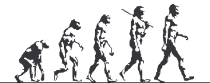
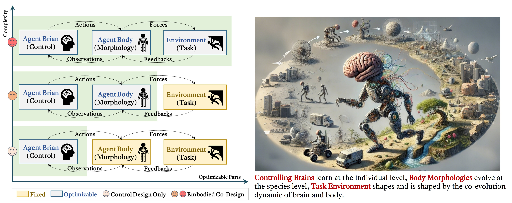
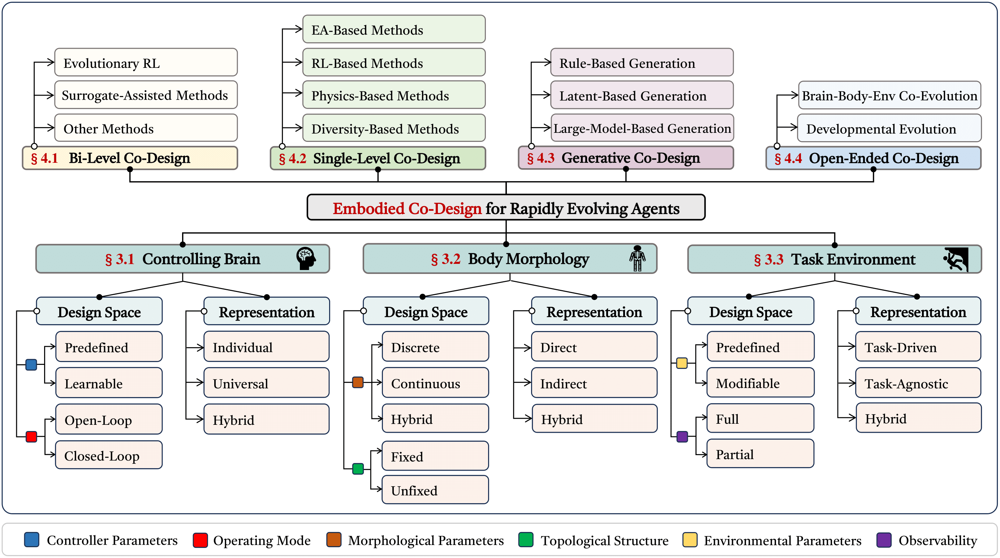
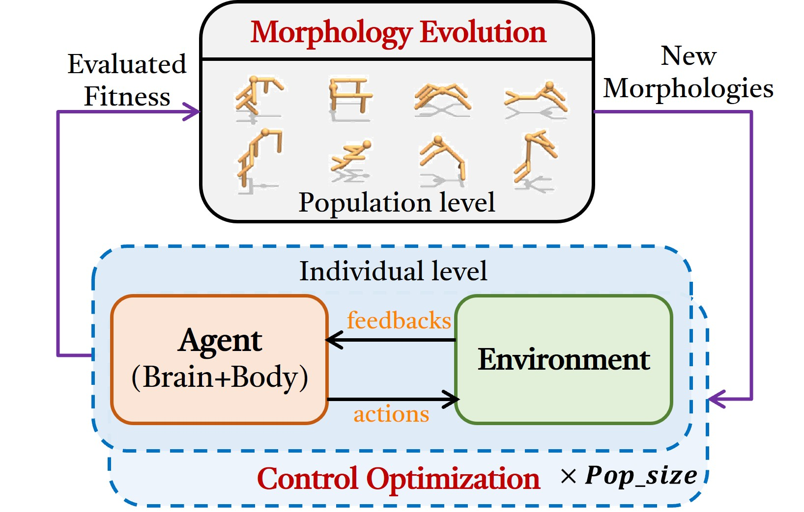
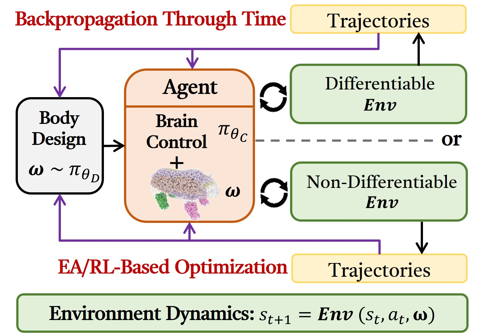
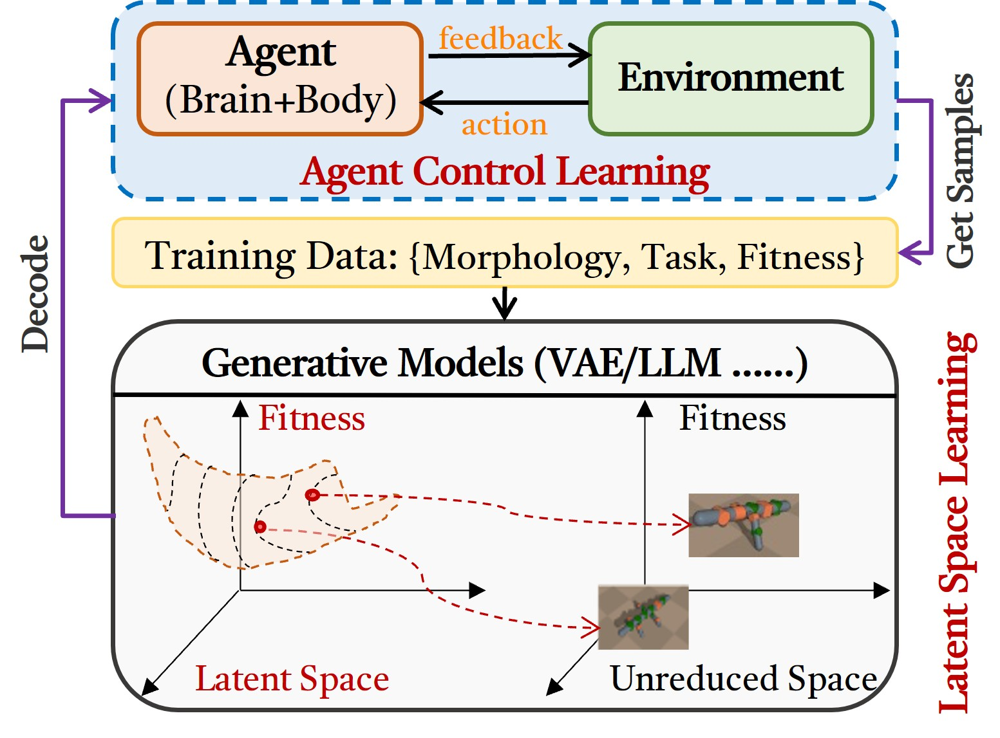
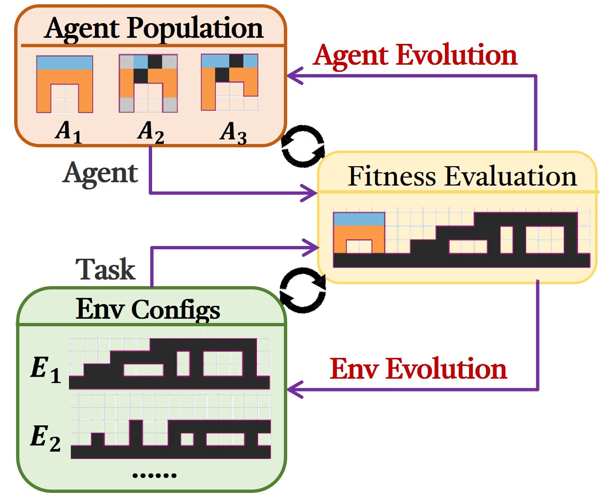

<div align=center></div>

<!-- [](https://arxiv.org/abs/1912.12033) -->
[](https://github.com/sindresorhus/awesome) 
[](https://github.com/Yuxing-Wang-THU/Awesome-Brain-Body-Co-Design-of-Embodied-Agents/graphs/commit-activity)
[](https://github.com/Yuxing-Wang-THU/Awesome-Brain-Body-Co-Design-of-Embodied-Agents/issues)
[](http://makeapullrequest.com)
[](https://github.com/Naereen/StrapDown.js/blob/master/LICENSE)


# 🚀 Embodied Co-Design for Rapidly Evolving Agents: Taxonomy, Frontiers, and Challenges
<p style="text-align:justify;"> The co-evolution of brain and body empowers animals to exhibit complex behaviors in their environments. Motivated by this natural synergy, Embodied Co-Design (ECD) has emerged as a transformative paradigm for the development of intelligent agents, including both physical robots and virtual creatures. In contrast to conventional approaches that primarily focus on control optimization, ECD jointly optimizes an agent's morphology and control, thereby enhancing environmental interactions and improving task performance compared to control design alone.</p>

<div align=center></div>

<p style="text-align:justify;"><b>🔑 Contributions to Embodied AI:</b> This work provides a comprehensive survey of ECD within the broader landscape of embodied intelligence. We begin with definitions of ECD and contextualize it within related fields such as evolutionary robotics, artificial life, and computational robot design. Next, we introduce a novel hierarchical taxonomy to classify design spaces and representation methods for control, morphology, and tasks, which allows us to analyze over one hundred recent studies in ECD. We review notable benchmarks and applications in both simulated and real-world scenarios. Finally, we identify significant challenges and offer insights into promising future research directions.

We hope that this survey can serve as a reference-worthy and stimulating contribution to the advancement of embodied intelligence while also providing valuable perspectives for related fields.</p></b>

# 📋 Update List

**2025/01/01**: Happy New Year! I am updating the survey on this topic and will **fully** update the site when the survey is updated to Arxiv.

**2025/12/01**: **[News]!** Our survey paper is publicly available on Arxiv ([Paper Link](https://arxiv.org/abs/2512.04770)).

# 🔥 Comments
* [](http://makeapullrequest.com)Feel free to pull requests or contact us if you find any related papers that are not included here.
The process to submit a pull request is as follows:
- a. Fork the project into your own repository.
- b. Add the Title, Paper link, Published in, Agent Type, Page/Code link in `README.md` using the following format:
```python
  |[Title](Paper Link)|Conference/Journal/Preprint|Agent Type|[Code/Project](Code/Project Link)|
```
- c. Submit the pull request to this branch.

* **We will update this page on a regular basis! So stay tuned~ :tada::tada::tada:. If you do find our survey or the repository helpful, please consider kindly giving a :star:, 谢谢你, Thanks a lot, Спасибо, ありがとう, 감사합니다, Merci, Grazie, Obrigado, Danke, شكراً.**

# 🎥 Overview

<p style="text-align:justify;">
Here is a quick menu .^_^. : </p>
  
- [🚀 Embodied Co-Design for Rapidly Evolving Agents: Taxonomy, Frontiers, and Challenges](#-embodied-co-design-for-rapidly-evolving-agents-taxonomy-frontiers-and-challenges)
- [📋 Update List](#-update-list)
- [🔥 Comments](#-comments)
- [🎥 Overview](#-overview)
	- [Taxonomy of Embodied Co-Design](#taxonomy-of-embodied-co-design)
	- [Frameworks of Embodied Co-Design](#frameworks-of-embodied-co-design)
- [:star: Latest ECD Works](#star-latest-ecd-works)
- [:one: Bi-Level Co-Design](#one-bi-level-co-design)
	- [Evolutionary Reinforcement Learning](#evolutionary-reinforcement-learning)
	- [Surrogate-Assisted Methods](#surrogate-assisted-methods)
	- [Other Methods](#other-methods)
- [:two: Single-Level Co-Design](#two-single-level-co-design)
	- [EA-Based Methods](#ea-based-methods)
	- [RL-Based Methods](#rl-based-methods)
	- [Physics-Based Methods](#physics-based-methods)
	- [Diversity-Based Methods](#diversity-based-methods)
	- [Other Methods](#other-methods-1)
- [:three: Generative Co-Design](#three-generative-co-design)
	- [Rule-Based Generation](#rule-based-generation)
	- [Latent-Based Generation](#latent-based-generation)
	- [LLM/VLM-Based Generation](#llmvlm-based-generation)
- [:four: Open-Ended Co-Design](#four-open-ended-co-design)
	- [Brain-Body-Env Co-Evolution](#brain-body-env-co-evolution)
	- [Developmental Co-Evolution](#developmental-co-evolution)
- [:five: Theoretical and Experimental Analysis of Embodied Co-Design](#five-theoretical-and-experimental-analysis-of-embodied-co-design)
- [:computer: Simulated Benchmarks for Embodied Co-Design](#computer-simulated-benchmarks-for-embodied-co-design)
- [:door: Embodied Co-Deisgn in Real World](#door-embodied-co-deisgn-in-real-world)
- [:book: Other Surveys Recommended](#book-other-surveys-recommended)
- [:envelope: Contact Information](#envelope-contact-information)

## Taxonomy of Embodied Co-Design
<p style="text-align:justify;"> 

The creation of an embodied agent hinges on three critical components: <b>Controlling Brain</b>, <b>Body Morphology</b>, <b>Task Environment</b>, and the <b>Co-Design</b> algorithm that optimizes these components.</p>

<p style="text-align:justify;"><b>1. Controlling Brain</b>: The controller (software) is responsible for perception-action coupling, enabling an agent to process sensory information and generate appropriate motor responses to control its body.</p>

<p style="text-align:justify;"><b>2. Body Morphology</b>: The physical embodiment (hardware) of an agent, including its shape, material properties, sensor placement, etc. Morphological design determines the agent’s physical capabilities and constraints, thereby impacting its performance and adaptability.</p>

<p style="text-align:justify;"><b>3. Task Environment</b>: This includes both task-specific conditions and broader environmental configurations. It not only defines the challenge faced by an agent but also provides the necessary feedback for learning and adaptation. Task requirements and environmental dynamics are crucial for shaping the agent’s behavior and learning objectives.</p>

<p style="text-align:justify;"><b>4. Co-Design Algorithms (A machine that can design other machines)</b>: An effective co-design algorithm integrates the optimization of control, morphology, and environmental interactions. Unlike traditional methods that treat these components separately, co-design algorithms aim to simultaneously refine all aspects, leading to more efficient and adaptive agents. These algorithms leverage advanced techniques to explore and exploit the co-design space, optimizing for performance across diverse tasks and environments.</p>

<div align=center></div>

<b>:book: We provide a detailed analysis of ECD methods based on the proposed taxonomy. Please refer to our paper when it is available online.</b>

## Frameworks of Embodied Co-Design  
The following picture introduces 4 general ECD frameworks, with the last sub-figure showing an example of the ECD process for creating a BipedalWalker agent.
<div align=center></div>

# :star: Latest ECD Works
|Paper| Published in |Embodied Agent|Code&Page|                               
|:---------|:---------------------------------------------------|:-------------:|:-------------|
|[Cross-embodied Co-design for Dexterous Hands](https://arxiv.org/pdf/2512.03743)|**Arxiv 2025**|Robot Manipulator|[Page](https://an-axolotl.github.io/co-design-for-dexterity.github.io/)|
|[Efficient Robot Design with Multi-Objective Black-Box Optimization and Large Language Models](https://arxiv.org/abs/2511.17178)|**Arxiv 2025**|Rigid Robot|-|
|[Learning to Design Soft Hands using Reward Models](https://arxiv.org/pdf/2510.17086)|**Arxiv 2025**|Robot Manipulator|-|
|[Morphological design methodologies of soft robots](https://www.the-innovation.org/article/doi/10.59717/j.xinn-inform.2025.100012)|**The Innovation Informatics 2025**|Soft Robot|-|
|[Terrain-aware morphology searching algorithm for self-reconfigurable modular robot in dynamic environment](https://www.sciencedirect.com/science/article/pii/S1568494625014954)|**Applied Soft Computing 2025**|Modular Robot|[code](https://github.com/TypeFloat/TAMS)|
|[Toward Humanoid Brain-Body Co-design: Joint Optimization of Control and Morphology for Fall Recovery](https://arxiv.org/pdf/2510.22336)|**Arxiv 2025**|Humanoid Robot|-|
|[Debate2Create: Robot Co-design via Large Language Model Debates](https://arxiv.org/pdf/2510.25850)|**IROSw 2025**|Rigid Robot|-|
|[Modeling, Embedded Control and Design of Soft Robots using a Learned Condensed FEM Model](https://arxiv.org/pdf/2503.15009)|**IEEE TRO**|Soft Robot|-|
|[CAD-Driven Co-Design for Flight-Ready Jet-Powered Humanoids](https://arxiv.org/pdf/2509.14935)|**Arxiv 2025**|Humanoid Robot||
|[Performance-guided Task-specific Optimization for Multirotor Design](https://arxiv.org/pdf/2510.04724)|**Arxiv 2025**|Multirotor Robot|[Page](https://youtu.be/V6w_DTKWvtc?si=kV4dyNnZw70lNWEf&t=88)|
|[Embracing Evolution: A Call for Body-Control Co-Design in Embodied Humanoid Robot](https://arxiv.org/html/2510.03081v1)|**Arxiv 2025**|Humanoid Robot|-|
|[Exploring Grammar-Guided Design and Evolution of Polyominoes with Modular Soft Robots](https://assets-eu.researchsquare.com/files/rs-6982435/v1_covered_f8c9b73d-68d3-4ced-9d8a-84c1ed7da10d.pdf?c=1759999150)|**GPEM 2025**|Modular Soft Robot|-|
|[Evolutionary Continuous Adaptive RL-Powered Co-Design for Humanoid Chin-Up Performance](https://arxiv.org/pdf/2509.26082)|**Arxiv 2025**|Humanoid Robot|-|
|[Evolution 6.0: Evolving Robotic Capabilities Through Generative Design](https://arxiv.org/pdf/2502.17034)|**Arxiv 2025**|Robot Tools|-|
|[RobotSmith: Generative Robotic Tool Design for Acquisition of Complex Manipulation Skills](https://arxiv.org/pdf/2506.14763)|**Arxiv 2025**|Robot Tools|[Page](https://umass-embodied-agi.github.io/RobotSmith/)|
|[Designing Tools with Control Confidence](https://arxiv.org/pdf/2510.12630)|**Arxiv 2025**|Robot Tools|[Page](https://github.com/ajitham123/Tool_design_control_confidence)|

# :one: Bi-Level Co-Design
<div align=center></div>

## Evolutionary Reinforcement Learning
<b>TLDR: Methods that focus on the bi-level nature of control learning together with morphology evolution (Baldwin Effect)</b>

<details>
<summary>References (Click to expand ⬇️)</summary>
	
|Paper| Published in |Embodied Agent|Code&Page|                               
|:---------|:---------------------------------------------------|:-------------:|:-------------|
[Neural graph evolution: Towards efficient automatic robot design](https://arxiv.org/pdf/1906.05370)|**ICLR 2019**|Rigid Robot|[Code](https://github.com/WilsonWangTHU/neural_graph_evolution)&[Page](https://www.cs.toronto.edu/~henryzhou/NGE_website/)|
[The body is not a given: Joint agent policy learning and morphology evolution](https://discovery.ucl.ac.uk/id/eprint/10081611/)|**AAMAS 2019**|Rigid Robot|[Page](https://www.youtube.com/watch?v=CHlecRim9PI)|
[Embodied Intelligence via Learning and Evolution](https://www.nature.com/articles/s41467-021-25874-z)|**Nature Comm. 2021**|Rigid Robot|[Code](https://github.com/agrimgupta92/derl)&[Page](https://hai.stanford.edu/news/how-bodies-get-smarts-simulating-evolution-embodied-intelligence)|
[Evolution Gym: A Large-Scale Benchmark for Evolving Soft Robots](https://arxiv.org/pdf/2201.09863)|**NIPS 2021**|Modular Soft Robot|[Code](https://github.com/EvolutionGym/evogym)&[Page](https://evolutiongym.github.io/)|
[Meta reinforcement learning for optimal design of legged robots](https://ieeexplore.ieee.org/abstract/document/9910025/)|**RAL 2022**|Quadrupedal Robot|-|
[Evolving Physical Instinct for Morphology and Control Co-Adaption](https://ieeexplore.ieee.org/document/10342243)|**IROS 2023**|Legged Robot|[Code](https://github.com/HPCL-EI/InstinctEvolution)|
[GA-based Co-Design Algorithm with Successive Halving](https://ieeexplore.ieee.org/document/10371512)|**IIAI-AAI 2023**|Modular Soft Robot|-|
[Leveraging Hyperbolic Embeddings for Coarse-to-Fine Robot Design](https://arxiv.org/abs/2311.00462v2)|**ICLR 2024**|Modular Soft Robot|[Code](https://github.com/drdh/HERD)&[Page](https://sites.google.com/view/hyperbolic-robot-design)|
[Structural Optimization of Lightweight Bipedal Robot via SERL](https://serl-iros2024.github.io/paper.pdf)|**IROS 2024**|Rigid Robot|[Page](https://serl-iros2024.github.io/)|
[A Morphological Transfer-Based Multi-Fidelity Evolutionary Algorithm for Soft Robot Design](https://ieeexplore.ieee.org/document/10709670/)|**IEEE CIM 2024**|Modular Soft Robot|[Code](https://github.com/HandingWangXDGroup/mtmfea)|
[Lamarckian Co-design of Soft Robots via Transfer Learning](https://dl.acm.org/doi/10.1145/3638529.3654180)|**GECCO 2024**|Modular Soft Robot|[Code](https://github.com/kazukazupi/LamarckianSoftRobot)|
[Evolution-Based Shape and Behavior Co-Design of Virtual Agents](https://ieeexplore.ieee.org/document/10403977)|**TVCG 2024**|Rigid Robot|-|
[ECoDe: A Sample-Efficient Method for Co-design of Robotic Agents](https://arxiv.org/pdf/2309.04085v2)|**AI 2024**|Rigid Robot|[Page](https://n-kish.github.io/ecode/)|
[Following Ancestral Footsteps: Co-Designing Agent Morphology and Behaviour with Self-Imitation Learning](https://openreview.net/forum?id=lHlhqoWfjw)|**EARL 2024**| Rigid Robot|[Code](https://github.com/serhez/cosil)&[Page](https://sites.google.com/view/self-co-imitation)|
[Learn and evolve to optimize robot morphologies](https://www.spiedigitallibrary.org/conference-proceedings-of-spie/13224/132240F/Learn-and-evolve-to-optimize-robot-morphologies/10.1117/12.3034893.short)|**IoTSC 2024**| Rigid Robot|-|
[Generating Freeform Endoskeletal Robots](https://arxiv.org/pdf/2412.01036)|**ICLR 2025**|Endoskeletal Robot|[Code](https://github.com/iffiX/endoskeletal)&[Page](https://endoskeletal.github.io/)|
|[A multi-objective optimization framework based on information sharing for serially connected robot design](https://link.springer.com/article/10.1007/s40747-025-02045-x)|**Complex & Intelligent Systems**|Modular Soft Robot|-|
|[Accelerating Soft Robot Evolution Using N-gram-based Controller Inheritance and Genetic Co-Design](https://dl.acm.org/doi/abs/10.1145/3712255.3726568)|**GECCO 2025**|Modular Soft Robot|-|
[Text2Robot: Evolutionary Robot Design from Text Descriptions](https://arxiv.org/pdf/2406.19963)|**ICRA 2025**|Legged Robot|[Code](https://github.com/generalroboticslab/Text2Robot)&[Page](http://www.generalroboticslab.com/blogs/blog/2024-06-28-text2robot/index.html)|
|[Evolutionary Continuous Adaptive RL-Powered Co-Design for Humanoid Chin-Up Performance](https://arxiv.org/pdf/2509.26082)|**Arxiv 2025**|Humanoid Robot|-|
|[Toward Humanoid Brain-Body Co-design: Joint Optimization of Control and Morphology for Fall Recovery](https://arxiv.org/pdf/2510.22336)|**Arxiv 2025**|Humanoid Robot|-|

</details>
	
## Surrogate-Assisted Methods
<b>TLDR: Methods that focus on using surrogate models to reduce the computational burden of the co-design process (how to efficiently evaluate a morphology without learning a specific controller?)</b>

<details>
<summary>References (Click to expand ⬇️)</summary>
	
|Paper| Published in |Embodied Agent|Code&Page|                               
|:---------|:---------------------------------------------------|:-------------:|:-------------|
|[Data-efficient Learning of Morphology and Controller for a Microrobot](https://arxiv.org/pdf/1905.01334)|**ICRA 2019**|Micro Robot|[Code](https://github.com/tholiao/learning-morph-and-ctrl)&[Page](https://sites.google.com/view/learning-robot-morphology)|
|[Data-efficient co-adaptation of morphology and behaviour with deep reinforcement learning](https://arxiv.org/pdf/1911.06832)|**CoRL 2020**|Rigid Robot|[Code](https://github.com/ksluck/Coadaptation)|
|[What robot do i need? fast co-adaptation of morphology and control using graph neural networks](https://arxiv.org/pdf/2111.02371)|**Arxiv 2021**|Rigid Robot|-|
|[Neural fidelity warping for efficient robot morphology design](https://arxiv.org/pdf/2012.04195)|**ICRA 2021**|Rigid Robot|[Code](https://github.com/husha1993/FWBO)|
|[Evolution Gym: A Large-Scale Benchmark for Evolving Soft Robots](https://arxiv.org/pdf/2201.09863)|**NIPS 2021**|Modular Soft Robot|[Code](https://github.com/EvolutionGym/evogym)&[Page](https://evolutiongym.github.io/)|
|[Co-imagination of Behaviour and Morphology of Agents](https://kevin-luck.com/assets/pdf/Sliacka_LOD_2024.pdf)|**LOD 2023**|Rigid Robot|-|
|[Learning-based design and control for quadrupedal robots with parallel-elastic actuators](https://ieeexplore.ieee.org/abstract/document/10008034)|**RAL 2023**|Quadrupedal Robot|-|
|[Co-imitation: learning design and behaviour by imitation](https://arxiv.org/pdf/2209.01207)|**AAAI 2023**|Rigid Robot|[Page](https://sites.google.com/view/co-imitation)|
|[Rapidly evolving soft robots via action inheritance](https://ieeexplore.ieee.org/document/10296048)|**TEVC 2024**|Modular Soft Robot|[Code](https://github.com/ShuleiLiu/AIEA)|
|[Co-Designing Tools and Control Policies for Robust Manipulation](https://arxiv.org/pdf/2409.11113)|**Arxiv 2024**|End Effector|[Page](https://sites.google.com/view/robust-codesign/)|
|[Pretraining-finetuning Framework for Efficient Co-design: A Case Study on Quadruped Robot Parkour](https://arxiv.org/pdf/2407.06770)|**Arxiv 2024**|Quadrupedal Robot|-|
|[Cagecoopt: enhancing manipulation robustness through caging-guided morphology and policy co-optimization](https://arxiv.org/abs/2409.11113)|**IROS 2025**|End Effector|[Page](https://sites.google.com/view/robust-codesign/)|
|[Effective Design and Interpretation in Voxel-Based Soft Robotics: A Part Assembly Approach with Bayesian Optimization](https://direct.mit.edu/isal/proceedings/isal2024/36/26/123476)|**A-Life 2024**|Modular Soft Robot|-|
|[Efficient co-adaptation of humanoid robot design and locomotion control using surrogate-guided optimization](https://www.sciencedirect.com/science/article/pii/S2667379725000464)|**Biomimetic Intelligence and Robotics**|Humanoid Robot|-|
|[Task-driven co-design of mobile manipulators](https://arxiv.org/pdf/2412.16635)|**RAL 2025**|Mobile Manipulators|[Page](https://moma-codesign.cs.uni-freiburg.de/)|
|[Cross-Task Collaborative Optimization Based on Knowledge Transfer for Soft Robot Design](https://ieeexplore.ieee.org/abstract/document/11015931)|**TEVC 2025**|Modular Soft Robot|-|
|[Accelerated co-design of robots through morphological pretraining](https://arxiv.org/pdf/2502.10862)|**Arxiv 2025**|Modular Robot|[Page](https://sites.google.com/view/co-design-mpt)|
|[Learning to Design Soft Hands using Reward Models](https://arxiv.org/pdf/2510.17086)|**Arxiv 2025**|Robot Manipulator|-|
</details>
	
## Other Methods

<details>
<summary>References (Click to expand ⬇️)</summary>
	
|Paper| Published in |Embodied Agent|Code&Page|                               
|:---------|:---------------------------------------------------|:-------------:|:-------------|
[Lamarckian evolution of simulated modular robots](https://www.frontiersin.org/journals/robotics-and-ai/articles/10.3389/frobt.2019.00009/full)|**Frontiers in Robotics and AI 2019**|Modular Robot|[Code](https://github.com/ci-group/revolve/)|
[Task-Agnostic Morphology Evolution](https://openreview.net/pdf?id=CGQ6ENUMX6)|**ICLR 2021**|Rigid Robot|[Code](https://github.com/jhejna/morphology-opt)&[Page](https://sites.google.com/view/task-agnostic-evolution)| -->
[Computational design of energy-efficient legged robots: Optimizing for size and actuators](https://hal.science/hal-02993624/document)|**ICRA 2021**|Rigid Robot|-|
[Simulation aided co-design for robust robot optimization](https://iris.unitn.it/bitstream/11572/376871/1/Robust_co_design_paper.pdf)|**RAL 2022**|Rigid Robot|-|
[Codesign of humanoid robots for ergonomic collaboration with multiple humans via genetic algorithms and nonlinear optimization](https://ieeexplore.ieee.org/document/10375237)|**Humanoids 2023**|Humanoid Robot|[Code](https://github.com/ami-iit/paper_sartore_2023_humanoids_codesign-ga-nl)|
[Evolution and learning in differentiable robots](https://www.roboticsproceedings.org/rss20/p100.pdf)|**RSS 2024**|Modular Soft Robot|[Code](https://github.com/lstrgar/ELDiR)&[Page](https://sites.google.com/view/eldir)|
[Improving Efficiency of Evolving Robot Designs via Self-Adaptive Learning Cycles and an Asynchronous Architecture](https://dl.acm.org/doi/pdf/10.1145/3638530.3664116)|**GECCO 2024**| Modular Rigid Robot|-|
|[MORPH: Design Co-optimization with Reinforcement Learning via a Differentiable Hardware Model Proxy](https://arxiv.org/pdf/2309.17227)|**ICRA 2024**|Rigid robot|[Page](https://roamlab.github.io/morph/)|

</details>

# :two: Single-Level Co-Design
<div align=center></div>

## EA-Based Methods
<b>TLDR: Methods that focus on evolving morphology and control simultaneously (how does natural evolution inform the co-design process?).</b>

<details>
<summary>References (Click to expand ⬇️)</summary>
	
|Paper| Published in |Embodied Agent|Code&Page|                               
|:---------|:---------------------------------------------------|:-------------:|:-------------|
|[Evolving 3D morphology and behavior by competition](https://citeseerx.ist.psu.edu/document?repid=rep1&type=pdf&doi=625cf770e697cc01b9201fd3b67456ac56a7a27b)|**ALife 1994**|Rigid Robot|-|
|[Automatic design and manufacture of robotic lifeforms](http://129.64.46.116/pr/golem/download/naturegolem.pdf)|**Nature 2000**|Rigid Robot|-|
|[Evolving virtual creatures and catapults](https://ieeexplore.ieee.org/abstract/document/6792861)|**A-Life 2007**|Rigid Robot|-|
|[Automatic Design and Manufacture of Soft Robots](https://ieeexplore.ieee.org/abstract/document/6096440/)|**TRO 2011**|Soft Robot|-|
|[Evolving Complete Robots with CPPN-NEAT: The Utility of Recurrent Connections](https://dl.acm.org/doi/abs/10.1145/2001576.2001775)|**GECCO 2011**|Spherical Robot|-|
|[Unshackling Evolution: Evolving Soft Robots with Multiple Materials and a Powerful Generative Encoding](https://dl.acm.org/doi/abs/10.1145/2661735.2661737)|**GECCO 2013**|Modular Soft Robot|[Page](https://www.youtube.com/watch?v=z9ptOeByLA4)|
|[Evolved Electrophysiological Soft Robots](http://jeffclune.com/publications/2014_CheneyCluneLipson_ElectrophysiologicalRobots_ALife.pdf)|**A-life 2014**|Modular Soft Robot|-|
|[Scalable co-optimization of morphology and control in embodied machines](https://royalsocietypublishing.org/doi/full/10.1098/rsif.2017.0937)|**RSI 2018**|Modular Soft Robot|[Code](https://github.com/ncheney/morphological-innovation-protection)|
[A good body is all you need: Avoiding catastrophic interference via agent architecture search](https://arxiv.org/pdf/2108.08398)|**NIPS 2021**|Wheeled Robot|[Code](https://github.com/jpp46/ARXIV2021)|
[Scale invariant robot behavior with fractals](https://arxiv.org/pdf/2103.04876)|**RSS 2021**|Modular Soft Robot|[Code](https://fractalrobots.github.io/)|
[Co-evolving morphology and control of soft robots using a single genome](https://arxiv.org/pdf/2212.11517)|**SSCI 2022**|Modular Soft Robot|[Code](https://github.com/fhtanaka/SGR)|
|[Robust co-design of robots via cascaded optimisation](https://arxiv.org/pdf/2504.06523)|**ICRA 2023**|Robot Arm|-|
|[Subtract to adapt: Autotomic robots](https://par.nsf.gov/servlets/purl/10492896)|**RoboSoft 2023**|Modular Soft Robot|[Code](https://github.com/jbongard/autotomy)|
|[Co-Design Optimisation of Morphing Topology and Control of Winged Drones](https://link.springer.com/article/10.1007/s42064-024-0259-8)|**ICRA 2024**|Winged Drones|[Code](https://github.com/ami-iit/paper_bergonti_2024_icra_codesign-morphing-drones)|
|[Concurrent optimization of modular robots for planetary landforms: A terrain-guided approach based on STGCN-GA](https://link.springer.com/article/10.1007/s42064-024-0259-8)|**Astrodynamics 2025**|Modular Robot|-|
|[Totipotent neural controllers for modular soft robots: Achieving specialization in body–brain co-evolution through Hebbian learning](https://www.sciencedirect.com/science/article/pii/S0925231224015820)|**Neurocumpting 2025**|Modular Soft Robot|[Code](https://github.com/ericmedvet/2dhmsr)|
|[Designing Tools with Control Confidence](https://arxiv.org/pdf/2510.12630)|**Arxiv 2025**|Robot Tools|[Page](https://github.com/ajitham123/Tool_design_control_confidence)|

</details>
	
## RL-Based Methods
<b>TLDR: Methods that focus on optimizing morphology and control simultaneously using Reinforcement Learning (physics-model free).</b>

<details>
<summary>References (Click to expand ⬇️)</summary>
	
|Paper| Published in |Embodied Agent|Code&Page|                               
|:---------|:---------------------------------------------------|:-------------:|:-------------|
|[Reinforcement learning for improving agent design](https://direct.mit.edu/artl/article/25/4/352/93262/Reinforcement-Learning-for-Improving-Agent-Design)|**A-LIFE 2019**|Rigid Robot|[Page](https://designrl.github.io/)|
|[Jointly learning to construct and control agents using deep reinforcement learning](https://arxiv.org/pdf/1801.01432)|**ICRA 2019**|Rigid Robot|[Page](https://home.ttic.edu/~cbschaff/nlimb/)&[Code](https://github.com/cbschaff/nlimb)|
|[Learning to control self-assembling morphologies: a study of generalization via modularity](https://proceedings.neurips.cc/paper_files/paper/2019/file/c26820b8a4c1b3c2aa868d6d57e14a79-Paper.pdf)|**NIPS 2019**|Modular Rigid Robot|[Page](https://pathak22.github.io/modular-assemblies/)&[Code](https://github.com/pathak22/modular-assemblies/)|
|[Hardware as policy: Mechanical and computational co-optimization using deep reinforcement learning](https://arxiv.org/abs/2008.04460)|**CoRL 2020**|Rigid Robot|[Page](https://roamlab.github.io/hwasp/)|
|[Modular mobile robot design selection with deep reinforcement learning](https://ml4eng.github.io/camera_readys/49.pdf)|**NIPSw 2020**|Modular Robot|[Page](https://youtu.be/f3PhXnuxk7g)|
|[Modular robot design synthesis with deep reinforcement learning](https://ojs.aaai.org/index.php/AAAI/article/view/6611)|**AAAI 2020**|Modular Robot|-|
|[Soft robots learn to crawl: Jointly optimizing design and control with sim-to-real transfer](https://arxiv.org/abs/2202.04575)|**RSS 2022**|Soft Robot|[Page](https://sites.google.com/ttic.edu/evolving-soft-robots)&[Code](https://github.com/cbschaff/evolving-soft-robots)|
|[Transform2act: Learning a transform-and-control policy for efficient agent design](https://proceedings.neurips.cc/paper_files/paper/2019/file/c26820b8a4c1b3c2aa868d6d57e14a79-Paper.pdf)|**ICLR 2022**|Rigid Robot|[Page](https://sites.google.com/view/transform2act)&[Code](https://github.com/Khrylx/Transform2Act)|
|[N-LIMB: Neural Limb Optimization for Efficient Morphological Design](https://proceedings.neurips.cc/paper_files/paper/2019/file/c26820b8a4c1b3c2aa868d6d57e14a79-Paper.pdf)|**Arxiv 2022**|Rigid Robot|[Page](https://sites.google.com/ttic.edu/nlimb)&[Code](https://github.com/cbschaff/nlimb2)|
|[Curriculum-based co-design of morphology and control of voxel-based soft robots](https://openreview.net/pdf?id=r9fX833CsuN)|**ICLR 2023**|Modular Soft Robot|[Code](https://github.com/Yuxing-Wang-THU/ModularEvoGym)&[Page](https://yuxing-wang-thu.github.io/projects/1_project/)|
|[PreCo: Enhancing Generalization in Co-Design of Modular Soft Robots via Brain-Body Pre-Training](https://proceedings.mlr.press/v229/wang23b/wang23b.pdf)|**CoRL 2023**|Modular Soft Robot|[Code](https://github.com/Yuxing-Wang-THU/ModularEvoGym)&[Page](https://yuxing-wang-thu.github.io/projects/1_project/)|
[Co-optimization of Morphology and Behavior of Modular Robots via Hierarchical Deep Reinforcement Learning](https://roboticsproceedings.org/rss19/p096.pdf)|**RSS 2023**|Modular Robot|-|
|[Learning to Design and Use Tools for Robotic Manipulation](https://arxiv.org/pdf/2311.00754)|**CoRL 2023**|Robot Manipulator Tools|[Page](https://robotic-tool-design.github.io/)|
|[Symmetry-Aware Robot Design with Structured Subgroups](https://proceedings.mlr.press/v202/dong23h/dong23h.pdf)|**ICML 2023**|Rigid robot|[Code](https://github.com/drdh/SARD)&[Page](https://sites.google.com/view/robot-design)|
|[CompetEvo: Towards Morphological Evolution from Competition](https://arxiv.org/pdf/2405.18300)|**IJCAI 2024**|Rigid bodied Robot|[Code](https://github.com/KJaebye/competevo)&[Page](https://competevo.github.io/)|
|[Reinforcement learning for freeform robot design](https://arxiv.org/pdf/2310.05670)|**ICRA 2024**|Modular Soft Robot|[Code](https://github.com/iffiX/RL4design)&[Page](https://www.youtube.com/watch?v=ybaEVDGvkTE)|
|[BodyGen: Advancing Towards Efficient Embodiment Co-Design](https://arxiv.org/pdf/2503.00533)|**ICLR 2025**|Rigid Robot|[Page](https://genesisorigin.github.io/)&[Code](https://github.com/GenesisOrigin/BodyGen)|
|[Efficient End-effector Co-Design by Demonstration for Deformable Fragile Object Manipulation](https://openreview.net/forum?id=zJKf0kpQTD)|**RSSw 2025**|End-effector|[Page](https://sites.google.com/view/efficient-end-effector-and-con/home)|
|[Co-Design and Control of a Biomimetic Snake Robot and its Contact Surfaces with Reinforcement Learning](https://openreview.net/forum?id=fUdHUU2ZCV)|**EWRL 2025**|Snake Robot||

</details>

## Physics-Based Methods
<b>TLDR: Methods that focus on optimizing morphology and control simultaneously using Differentiable Simulation or analytical physics model).</b>

<details>
<summary>References (Click to expand ⬇️)</summary>

|Paper| Published in |Embodied Agent|Code&Page|                               
|:---------|:---------------------------------------------------|:-------------:|:-------------|
|[Functional Co-Optimization Of Articulated Robots](https://ieeexplore.ieee.org/document/7989587)|**ICRA 2017**|Articulated Robot|-|
|[Interactive Co-Design of Form and Function for Legged Robots using the Adjoint Method](https://arxiv.org/pdf/1801.00385)|**Arxiv 2018**|Legged Robot|[Page](https://www.youtube.com/watch?v=zrMZBgTbJho)|
|[Learning-in-the-loop optimization: End-to-end control and co-design of soft robots through learned deep latent representations](https://proceedings.neurips.cc/paper/2019/file/438124b4c06f3a5caffab2c07863b617-Paper.pdf)|**NIPS 2019**|Soft Robot|-|
|[One robot for many tasks: Versatile co-design through stochastic programming](https://ieeexplore.ieee.org/abstract/document/8972465)|**RAL 2020**|Legged Robot|-|
|[An End-to-End Differentiable Framework for Contact-Aware Robot Design](https://people.csail.mit.edu/jiex/papers/DiffHand/paper.pdf)|**RSS 2021**|Rigid Robot|[Code](https://github.com/eanswer/DiffHand)&[Page](https://diffhand.csail.mit.edu/)|
|[Diffaqua: A differentiable computational design pipeline for soft underwater swimmers with shape interpolation](https://dl.acm.org/doi/pdf/10.1145/3450626.3459832)|**ACM TOG 2021**|Soft Gripper|[Code](https://github.com/mit-gfx/DiffAqua)&[Page](https://proceedings.neurips.cc/paper/2019/hash/438124b4c06f3a5caffab2c07863b617-Abstract.html)|
|[Learning tool morphology for contact-rich manipulation tasks with differentiable simulation](https://ieeexplore.ieee.org/document/10161453)|**ICRA 2022**|Robot Tools|-|
|[Optimization of humanoid robot designs for human-robot ergonomic payload lifting](https://arxiv.org/pdf/2211.13503)|**Humanoids 2022**|Humanoids Robot|-|
|[Softzoo: A soft robot co-design benchmark for locomotion in diverse environments](https://openreview.net/pdf?id=Xyme9p1rpZw)| **ICLR 2023**|Soft Robot|[Code](https://github.com/zswang666/softzoo)&[Page](https://sites.google.com/view/softzoo-iclr-2023)|
|[4D topology optimization: Integrated optimization of the structure and self-actuation of soft bodies for dynamic motions](https://arxiv.org/pdf/2302.00905)|**CMAME 2023**|Soft Robot|[Page](https://www.youtube.com/watch?v=sPY2jcAsNYs)|
|[Efficient automatic design of robots](https://www.pnas.org/doi/pdf/10.1073/pnas.2305180120)|**PNAS 2023**|Soft Robot|[Code](https://github.com/robodiff/robodiff)|
|[Topology optimization of locomoting soft bodies using material point method](https://arxiv.org/pdf/2203.16793)|**Structural and Multidisciplinary Optimization 2023**|Soft Robot|-|
|[Task2Morph: Differentiable Task-inspired Framework for Contact-Aware Robot Design](https://arxiv.org/pdf/2403.19093)|**IROS 2023**|Rigid Robot hand|[Code](https://github.com/Caiyishuai/Task2Morph)|
|[Differentiable Soft-Robot Generation](https://dl.acm.org/doi/10.1145/3583131.3590408)|**GECCO 2023**|Soft Robot|-|
|[Humanoid Robot Co-Design: Coupling Hardware Design with Gait Generation via Hybrid Zero Dynamics](https://ieeexplore.ieee.org/abstract/document/10383745)|**CDC 2023**|Humanoid Robot|-|
|[Computational synthesis of locomotive soft robots by topology optimization](https://www.science.org/doi/pdf/10.1126/sciadv.adn6129)|**Science Advances 2024**|Soft Robot|-|
|[Co-Designing Manipulation Systems Using Task-Relevant Constraints](https://ieeexplore.ieee.org/abstract/document/10611686)|**ICRA 2024**|Robot Manipulator|-|
|[Engineering compliance in legged robots via robust co-design](https://ieeexplore.ieee.org/abstract/document/10508097)|**TMEC 2024**|Quadrupedal Robot|-|
|[Joint Optimization of Robot Design and Motion Parameters using the Implicit Function Theorem](https://m.roboticsproceedings.org/rss13/p03.pdf)|**RSS 2024**|Quadrupedal Robot|-|
|[Computational co-design of structure and feedback controller for locomoting soft robots](https://arxiv.org/pdf/2407.09270)|**Structural and Multidisciplinary Optimization 2025**|Soft Robot|-|
|[Making use of design-aware policy optimization in legged-robotics co-design](https://openreview.net/pdf?id=utaVaqRVO4)|**CoRLw 2024**|Legged Robot|-|
|[Modeling, Embedded Control and Design of Soft Robots using a Learned Condensed FEM Model](https://arxiv.org/pdf/2503.15009)|**IEEE TRO**|Soft Robot|-|
|[A Design Co-Pilot for Task-Tailored Manipulators](https://arxiv.org/pdf/2509.13077)|**Arxiv 2025**|Manipulators|[Page](https://cobra.cps.cit.tum.de/tasks?version=2022&metadata__tags=Robot_designer)|

</details>
	
## Diversity-Based Methods
<b>TLDR: Methods that focus on generating morphological diversity (how to effectively keep the morphological diversity?).</b>

<details>
<summary>References (Click to expand ⬇️)</summary>
	
|Paper| Published in |Embodied Agent|Code&Page|                               
|:---------|:---------------------------------------------------|:-------------:|:-------------|
|[Solving deceptive tasks in robot body-brain co-evolution by searching for behavioral novelty](https://ieeexplore.ieee.org/abstract/document/5687250)|**ICISDA 2010**|Virtual Creature|-|
|[Evolving a diversity of virtual creatures through novelty search and local competition](https://dl.acm.org/doi/abs/10.1145/2001576.2001606)|**GECCO 2011**|Virtual Creature|-|
|[Quality and Diversity in Evolutionary Modular Robotics](https://ieeexplore.ieee.org/document/9308511)|**SSCI 2020**|Modular Robot|-|
|[Seeking Quality Diversity in Evolutionary Co-design of Morphology and Control of Soft Tensegrity Modular Robots](https://dl.acm.org/doi/10.1145/3449639.3459311)|**GECCO 2021**|Modular Robot|[Page](https://www.youtube.com/playlist?list=PLtSGcQw3Wpzzoa3nev1RUmMGRSFb18jFf)|
|[Effects of compliant and structural parts in evolved modular robots](https://direct.mit.edu/isal/proceedings/isal2023/35/76/116931)|**A-Life 2023**|Modular Robot|[Code](https://github.com/EmmaStensby/modular-robots-sea)|
[A ’MAP’ to find high-performing soft robot designs: Traversing complex design spaces using MAP-elites and Topology Optimization](https://arxiv.org/pdf/2407.07591)|**IROS 2024**|Rigid Manipulator|N/A|
|[No-brainer: Morphological Computation driven Adaptive Behavior in Soft Robots](https://arxiv.org/pdf/2407.16613)|**SAB 2024**|Modular Soft Robot|[Code](https://github.com/mertan-a/no-brainer)|
|[Controller Distillation Reduces Fragile Brain-Body Co-Adaptation and Enables Migrations in MAP-Elites](https://arxiv.org/pdf/2504.06523)|**GECCO 2025**|Modular Soft Robot|[Code](https://github.com/mertan-a/pollination)|
|[Body and Brain Quality-Diversity in Robot Swarms](https://dl.acm.org/doi/10.1145/3664656)|**TELO 2025**|Modular Robot|[Code](https://github.com/Body-Brain-QD-in-Robotic-Swarms/TELO-2023)|
|[Enhancing Adaptability in Embodied Agents: A Multi-Quality-Diversity Approach](https://ieeexplore.ieee.org/abstract/document/11119655)|**TEC 2025**|Modular Soft Robot|[Code](https://github.com/giorgia-nadizar/BBB-QD)|
|[Quality-diversity in problems with composite solutions: a case study on body–brain robot optimization](https://link.springer.com/article/10.1007/s10710-025-09520-x)|**GPEM 2025**|Modular Soft Robot|-|

</details>

## Other Methods 
<b>TLDR: Actuating Shape-Changed robots.</b>

<details>
<summary>References (Click to expand ⬇️)</summary>
	
|Paper| Published in |Embodied Agent|Code&Page|                               
|:---------|:---------------------------------------------------|:-------------:|:-------------|
|[Shape change and control of pressure-based soft agents](https://direct.mit.edu/isal/proceedings/isal2022/34/37/112294)|**ALIFE 2022**|Pressure-Based Soft Robot|[Code](https://github.com/pigozzif/PressureSoftAgents)&[Page](https://pressuresoftagents.github.io/)|
|[DittoGym: Learning to Control Soft Shape-Shifting Robots](https://arxiv.org/pdf/2401.13231)|**ICLR 2024**|Soft Shape-Shifting Robots|[Code](https://github.com/suninghuang19/dittogym)&[Page](https://dittogym.github.io/)|

</details>

# :three: Generative Co-Design
<div align=center></div>

## Rule-Based Generation
<b>TLDR: Methods that focus on generating agent morphologies using rule-based systems (grammar, L-systems, etc.).</b>

<details>
<summary>References (Click to expand ⬇️)</summary>
	
|Paper| Published in |Embodied Agent|Code&Page|                               
|:---------|:---------------------------------------------------|:-------------:|:-------------|
|[Evolution of generative design systems for modular physical robots](https://ieeexplore.ieee.org/abstract/document/933266)|**ICRA 2001**|Modular Robot|-|
|[Generative representations for the automated design of modular physical robots](https://ntrs.nasa.gov/api/citations/20030107313/downloads/20030107313.pdf)|**TRA 2004**|Rigid Robot|-|
|[Creature Academy: A System for Virtual Creature Evolution](https://ieeexplore.ieee.org/abstract/document/4631243)|**CEC 2008**|Rigid Robot|-|
[Robogrammar: graph grammar for terrain-optimized robot design](https://dl.acm.org/doi/10.1145/3414685.3417831)|**TOG 2020**|Rigid Robot|[Code](https://github.com/allanzhao/RoboGrammar)&[Page](https://people.csail.mit.edu/jiex/papers/robogrammar/index.html)|
[Automatic Co-Design of Aerial Robots Using a Graph Grammar](https://cfg.mit.edu/assets/images/ieee-xplore-full-text-pdf-.pdf)|**IROS 2022**|UAV|-|
|[Synergizing Morphological Computation and Generative Design: Automatic Synthesis of Tendon-Driven Grippers](https://arxiv.org/pdf/2410.07865) |**IROS 2024**|Tendon-Driven Grippers|[Code](https://github.com/aimclub/rostok)&[Page](https://rostok.readthedocs.io/en/latest/)|
|[Exploring Grammar-Guided Design and Evolution of Polyominoes with Modular Soft Robots](https://assets-eu.researchsquare.com/files/rs-6982435/v1_covered_f8c9b73d-68d3-4ced-9d8a-84c1ed7da10d.pdf?c=1759999150)|**GPEM 2025**|Modular Soft Robot|-|
|[Cross-embodied Co-design for Dexterous Hands](https://arxiv.org/pdf/2512.03743)|**Arxiv 2025**|Robot Manipulator|[Page](https://an-axolotl.github.io/co-design-for-dexterity.github.io/)|

</details>

## Latent-Based Generation
<b>TLDR: Methods that focus on generating agent morphologies using latent-based systems (GAN, VAE, etc.).</b>

<details>
<summary>References (Click to expand ⬇️)</summary>
	
|Paper| Published in |Embodied Agent|Code&Page|                               
|:---------|:---------------------------------------------------|:-------------:|:-------------|
[Emergent hand morphology and control from optimizing robust grasps of diverse objects](https://arxiv.org/pdf/2012.12209)|**ICRA 2021**|Robot Hand|[Code](https://xinleipan.github.io/emergent_morphology/)|
[GLSO: Grammar-guided Latent Space Optimization for Sample-efficient Robot Design Automation](https://proceedings.mlr.press/v205/hu23c/hu23c.pdf)|**CoRL 2022**|Rigid Robot|[Code](https://github.com/JiahengHu/GLSO)|
|[Modular Robot Design Optimization with Generative Adversarial Networks](https://ieeexplore.ieee.org/abstract/document/9812091)|**ICRA 2022**|Modular Rigid Robot|-|
|[MorphVAE: Advancing Morphological Design of Voxel-Based Soft Robots with Variational Autoencoders](https://ojs.aaai.org/index.php/AAAI/article/view/28904)|**AAAI 2024**|Modular Soft Robot|[Code](https://github.com/WoodySJR/MorphVAE)|
|[DiffuseBot: Breeding Soft Robots With Physics-Augmented Generative Diffusion Models](https://arxiv.org/pdf/2302.00905)|**NIPS 2023**|Soft Robot|[Code](https://github.com/EvolutionGym/evogym)&[Page](https://diffusebot.github.io/)|
|[RoboNet: A Sample-Efficient Robot co-design Generator](https://openreview.net/pdf?id=VdT2R6XSlV)|**CoRLw 2024**|Rigid Robots|-|
|[Morphology Evolution for Embodied Robot Design  with a Classifier-Guided Diffusion Model](https://ieeexplore.ieee.org/abstract/document/11003187)|**TEC 2025**|Modular Soft Robot|[Code](https://github.com/HandingWangXDGroup/CDMEO)|
|[Generating Freeform Endoskeletal Robots](https://arxiv.org/abs/2412.01036)|**ICLR 2025**|Endoskeletal Robots|[Code](https://github.com/iffiX/endoskeletal)&[Page](https://endoskeletal.github.io/)|
|[TE-RoboNet: Transfer Enhanced RoboNet for Sample-Efficient Generation of Robot Co-Designs](https://openreview.net/forum?id=sbjbD8ftCH)|**EWRL 2025**|Rigid Robot||
|[COGENT: Co-design of Robots with GFlowNets](https://openreview.net/forum?id=IfLKMWrroL)|**EWRL 2025**|Modular Robot|-|
|[Terrain-aware morphology searching algorithm for self-reconfigurable modular robot in dynamic environment](https://www.sciencedirect.com/science/article/pii/S1568494625014954)|**Applied Soft Computing 2025**|Modular Robot|[code](https://github.com/TypeFloat/TAMS)|
</details>

## LLM/VLM-Based Generation
<b>TLDR: Methods that focus on generating agent morphologies using large models (Diffusion Model, LLM, etc.).</b>

<details>
<summary>References (Click to expand ⬇️)</summary>

|Paper| Published in |Embodied Agent|Code&Page|                               
|:---------|:---------------------------------------------------|:-------------:|:-------------|
|[Evolution Through Large Models](https://arxiv.org/abs/2206.08896)|**Arxiv 2023**|Soft Robot|[Code](https://github.com/CarperAI/OpenELM)|
|[How can LLMs transform the robotic design process?](https://www.nature.com/articles/s42256-023-00669-7)|**Nature Machine Intelligence 2023**|Robot Gripper|-|
|[How Can Large Language Models Help Humans in Design and Manufacturing?](https://arxiv.org/abs/2307.14377)|**Arxiv 2023**|-|-|
|[LASeR: LASeR: Towards Diversified and Generalizable Robot Design with Large Language Models](https://openreview.net/forum?id=7mlvOHL6qJ)|**ICLR 2025**|Modular Soft Robot|[Code](https://github.com/WoodySJR/LASeR)|
|[RoboMoRe: LLM-based Robot Co-design via Joint Optimization of Morphology and Reward](https://arxiv.org/pdf/2506.00276?)|**Arxiv 2025**|Rigid Robot|-|
|[Large Language Models as Natural Selector for Embodied Soft Robot Design](https://arxiv.org/pdf/2503.02249)|**Arxiv 2025**|Modular Soft Robot|[Code](https://github.com/AisenGinn/evogym_data_generation)|
|[RoboMorph: Evolving Robot Morphology using Large Language Models](https://arxiv.org/pdf/2407.08626?)|**ICLRw 2025**|Rigid Robot|-|
|[VLMGINEER: Vision Language Models as Robotic Toolsmiths](https://arxiv.org/abs/2507.12644)|**Arxiv 2025**|Rigid Robot|[Page](https://vlmgineer.github.io/release)|
|[CUDA-Accelerated Soft Robot Neural Evolution with Large Language Model Supervision](https://arxiv.org/pdf/2405.00698v1)|**ICRAw 2024**|Soft Robot|-|
|[Evolution 6.0: Evolving Robotic Capabilities Through Generative Design](https://arxiv.org/pdf/2502.17034)|**Arxiv 2025**|Robot Tools|-|
|[RobotSmith: Generative Robotic Tool Design for Acquisition of Complex Manipulation Skills](https://arxiv.org/pdf/2506.14763)|**Arxiv 2025**|Robot Tools|[Page](https://umass-embodied-agi.github.io/RobotSmith/)|
|[Debate2Create: Robot Co-design via Large Language Model Debates](https://arxiv.org/pdf/2510.25850)|**IROSw 2025**|Rigid Robot|-|
|[Efficient Robot Design with Multi-Objective Black-Box Optimization and Large Language Models](https://arxiv.org/abs/2511.17178)|**Arxiv 2025**|Rigid Robot|-|

</details>

# :four: Open-Ended Co-Design
<div align=center></div>

## Brain-Body-Env Co-Evolution 
<b>TLDR: Methods that focus on brain-body-environment co-optimization.</b>

<details>
<summary>References (Click to expand ⬇️)</summary>
	
|Paper| Published in |Embodied Agent|Code&Page|                               
|:---------|:---------------------------------------------------|:-------------:|:-------------|
|[Co-optimising robot morphology and controller in a simulated open-ended environment](https://arxiv.org/pdf/2104.03062)|**EvoStar 2021**|Legged Robot|[Code](https://github.com/EmmaStensby/poet-morphology)|
|[Co-Designing Manipulation Systems Using Task-Relevant Constraints](https://www.static.tu.berlin/fileadmin/www/10002220/Publications/Vaish-22-ICRA.pdf)|**ICRA 2022**|Rigid Manipulator|N/A|
|[Curriculum Reinforcement Learning via Morphology-Environment Co-Evolution](https://arxiv.org/pdf/2309.12529)|**Arxiv 2023**|Rigid Robot|N/A|
|[Brain–body-task co-adaptation can improve autonomous learning and speed of bipedal walking](https://iopscience.iop.org/article/10.1088/1748-3190/ad8419/pdf)|**Bioinspir. Biomim. 2024**|Legged Robot|N/A|
|[LLM-POET: Evolving Complex Environments using Large Language Models](https://arxiv.org/pdf/2406.04663)|**GECCO 2024 Companion**|2D Modular Soft Robot|N/A|
|[Evolving Complex Environments in Evolution Gym using Large Language Models](https://ieeexplore.ieee.org/abstract/document/10626609)|**ICASSPW 2024**|2D Modular Soft Robot</br>(Voxel-Based Soft Robot)|N/A|
|[Task-Based Design and Policy Co-Optimization for Tendon-driven Underactuated Kinematic Chains](https://arxiv.org/pdf/2405.14566)|**Arxiv 2024**|Rigid Manipulator|[Page](https://roamlab.github.io/tentamorph/)|

</details>

## Developmental Co-Evolution

<details>
<summary>References (Click to expand ⬇️)</summary>
	
|Paper| Published in |Embodied Agent|Code&Page|                               
|:---------|:---------------------------------------------------|:-------------:|:-------------|
|[Evolving Complete Agents using Artificial Ontogeny](https://www.lri.fr/~waller/cours/fr/articles/2008/schoenauer_robot1.pdf)|**Morph 2003**|Rigid Robot|-|
|[An Improved System for Artificial Creatures Evolution](https://citeseerx.ist.psu.edu/document?repid=rep1&type=pdf&doi=2d64f5e208b2e841dfc30ea6daffb4e259bae75f)|**ALife 2006**|Virtual Creature|-|
|[Open-ended behavioral complexity for evolved virtual creatures](https://dl.acm.org/doi/abs/10.1145/2463372.2463411)|**GECCO 2013**|Virtual Creature|-|
|[Artificial Metamorphosis: Evolutionary Design of Transforming, Soft-Bodied Robots](https://ieeexplore.ieee.org/document/7547406)|**A-Life 2022**|Virtual Creature|-|
|[Morphological Development at the Evolutionary Timescale: Robotic Developmental Evolution](https://direct.mit.edu/artl/article/28/1/3/109958/Morphological-Development-at-the-Evolutionary)|**A-Life 2022**|Soft Robot|-|
[A Unified Substrate for Body-Brain Co-evolution](https://arxiv.org/pdf/2203.12066)|**ICLRw 2022**|Vitual Creature|[Code](https://github.com/sidneyp/neural-cellular-robot-substrate)|
|[Evolution of Developmental Plasticity of Soft Virtual Creatures in Changing Environments](https://ieeexplore.ieee.org/document/10611998)|**CEC 2024**|Modular Soft Robot|-|
|[Eco-Evo-Devo in the Adaptive Evolution of Artificial Creatures Within a 3D Physical Environment](https://www.mdpi.com/2079-9292/14/2/354)|**Electronics 2025**|Vitural Creature|[Page](https://figshare.com/articles/media/Supplementary_Videos_Morphological_changes_and_behavior_for_best_individual_in_each_case_/27100309)|

</details>

# :five: Theoretical and Experimental Analysis of Embodied Co-Design
<b>TLDR: Papers that investigates the synergy of Brain, Body, and Environment.</b>

<details>
<summary>References (Click to expand ⬇️)</summary>
	
|Paper| Published in |Embodied Agent|Code&Page| 
|:---------|:---------------------------------------------------|:-------------:|:-------------|
|[Fitness functions in evolutionary robotics: A survey and analysis](https://www.sciencedirect.com/science/article/pii/S0921889008001450)|**RAS 2009**|-|-|
|[ALife approach for body-behavior predator–prey coevolution: body first or behavior first?](https://link.springer.com/article/10.1007/s10015-013-0096-y)|**ALR 2013**|-|-|
|[Beyond black-box optimization: a review of selective pressures for evolutionary robotics](https://link.springer.com/article/10.1007/s12065-014-0110-x)|**EI 2014**|-|-|
|[Simple or complex bodies? Trade-offs in exploiting body morphology for control](https://link.springer.com/chapter/10.1007/978-3-319-43784-2_17)|**Book 2017**|-|-|
[The trade-off between morphology and control in the co-optimized design of robots](https://journals.plos.org/plosone/article/file?id=10.1371/journal.pone.0186107&type=printable)|**PLOS ONE 2017**|Rigid Robot|-|
|[How morphological development can guide evolution](https://www.nature.com/articles/s41598-018-31868-7)|**Scientific Reports 2018**|-|-|
|[Evolving-controllers versus learning-controllers for morphologically evolvable robots](https://research.vu.nl/files/130180393/Miras2020_Chapter_Evolving_ControllersVersusLearningControllersForMorphologicallyEvolvableRobots.pdf) |**EvoStar 2020**|3D Modular Robot|-|
|[A comparative analysis on genome pleiotropy for evolved soft robots](https://dl.acm.org/doi/abs/10.1145/3520304.3528977) |**GECCO 2022**|3D Modular Soft Robot|[Code](https://github.com/Co-Evolve/genome-pleiotropy)|
|[Comparative studies of evolutionary methods and RL for learning behavior of virtual creatures](https://ieeexplore.ieee.org/abstract/document/10022282)|**SSCI 2022**|Modular Soft Robot|[Code](https://github.com/sttkm/ComparisonOnEvogym)|
|[The Effects of Learning in Morphologically Evolving Robot Systems](https://www.frontiersin.org/journals/robotics-and-ai/articles/10.3389/frobt.2022.797393/full)|**Frontiers 2022**|Modular Robot|-|
|[The Dynamic of Body and Brain Co-Evolution](https://arxiv.org/pdf/2011.11440)|**ADAPTIVE BEHAVIOR**|Rigid Robot|[Page](https://youtu.be/rSngmzd5hiE)|
|[Subtract to adapt: Autotomic robots](https://par.nsf.gov/servlets/purl/10492896)|**RoboSoft 2023**|Modular Soft Robot|N/A|
|[Enhancing robot evolution through Lamarckian principles](https://www.nature.com/articles/s41598-023-48338-4)|**Scientific Reports 2023**|Modular Robot|N/A|
|[Modular controllers facilitate the co-optimization of morphology and control in soft robots](https://dl.acm.org/doi/pdf/10.1145/3583131.3590416)|**GECCO 2023**|Modular Soft Robot|[code](https://github.com/mertan-a/gecco-23)|
|[How the morphology encoding influences the learning ability in body-brain co-optimization](https://arts.units.it/retrieve/38193007-3420-4082-8af5-9de6a3385725/2023-GECCO-MorphologyEncodingLearningInVSRs-Post_print.pdf)|**GECCO 2023**|Modular Robot|[code](https://github.com/karinemiras/revolve2/tree/plasticoding_v3)|
[A comparison of controller architectures and learning mechanisms for arbitrary robot morphologies](https://arxiv.org/pdf/2309.13908)|**SSCI 2023**|Modular Rigid Robot|N/A|
[How Perception, Actuation, and Communication Impact the Emergence of Collective Intelligence in Simulated Modular Robots](https://ieeexplore.ieee.org/document/10791479)|**ALIFE 2024**|Modular Robot|N/A|
[Co-Optimization of Robot Design and Control: Enhancing Performance and Understanding Design Complexity](https://arxiv.org/pdf/2409.08621)|**Arxiv 2024**|-|[Code](https://github.com/EtorArza/NestedOpt)|
|[Investigating Premature Convergence in Co-optimization of Morphology and Control in Evolved Virtual Soft Robots](https://books.google.com.hk/books?hl=zh-CN&lr=&id=Y4f9EAAAQBAJ&oi=fnd&pg=PA38&ots=IjMl3-hZx0&sig=JnsRuJQAu0ksg_AOW7c0GxXUG1I&redir_esc=y#v=onepage&q&f=false)|**EuroGP 2024**|Modular Soft Robot|N/A|
|[The role of morphological variation in evolutionary robotics: Maximizing performance and robustness](https://arxiv.org/pdf/2208.02809)|**EC 2024**|Rigid Robot|N/A|
|[Premature convergence in morphology and control co-evolution: a study](https://journals.sagepub.com/doi/abs/10.1177/10597123231198497)|**Adaptive Behavior 2024**|-|N/A|
|[Artificial evolution of robot bodies and control: on the interaction between evolution, individual and cultural learning](https://napier-repository.worktribe.com/OutputFile/2812314)|**RoyalSoc Trans**|-|N/A|
|[Evolutionary Brain-Body Co-Optimization Consistently Fails to Select for Morphological Potential](https://arxiv.org/abs/2508.17464)|**A-Life 2025**|Modular Soft Robot|[Code](https://github.com/mertan-a/morphology-fitness-landscape)|
|[Morphological Cognition: Classifying MNIST Digits Through Morphological Computation Alone](https://arxiv.org/abs/2508.17469)|**A-Life 2025**|Modular Soft Robot|[Code](https://github.com/mertan-a/morphological-cognition)|
|[The Morphology-Control Trade-Off: Insights into Soft Robotic Efficiency](https://arxiv.org/abs/2503.16127)|**Arxiv 2025**|Modular Soft Robot|-|
|[Selection pressure shapes epistatic gene interactions in the evolution of robots](https://osf.io/ecpfw/download)|-|Modular Robot|[code](https://github.com/karinemiras/revolve2/tree/plasticoding_v3)|
|[Robots that Evolve with Us: Modular Co-Design for Personalization, Adaptability, and Sustainability](https://arxiv.org/pdf/2509.11622)|**Arxiv 2025**|Modular Robot|-|
|[Evolutionary Brain-Body Co-Optimization Consistently Fails to Select for Morphological Potential](https://arxiv.org/abs/2508.17464)|**A-Life 2025**|Modular Soft Robot|[Code](https://github.com/mertan-a/morphology-fitness-landscape)|

</details>

# :computer: Simulated Benchmarks for Embodied Co-Design
<div align=center></div>
<details>
<summary>References (Click to expand ⬇️)</summary>
	
|Platform|Related Papers|Agent|Differentiable Sim|                              
|:---------|:--------------------------------------------|:-------------:|:--:|
|**Evolution Gym**</br>[Code](https://github.com/EvolutionGym/evogym)&[Page](https://evolutiongym.github.io/)</br>**ModularEvoGym**</br>[Code](https://github.com/Yuxing-Wang-THU/ModularEvoGym)&[Page](https://github.com/Yuxing-Wang-THU/ModularEvoGym)|[Evolution gym: A large-scale benchmark for evolving soft robots (NIPS 2021)](https://arxiv.org/abs/2201.09863)</br>1. [PreCo: Enhancing Generalization in Co-Design of Modular Soft Robots via Brain-Body Pre-Training (CoRL 2023)](https://proceedings.mlr.press/v229/wang23b/wang23b.pdf)</br>2. [Rapidly Evolving Soft Robots via Action Inheritance (IEEE TEC 2024)](https://ieeexplore.ieee.org/abstract/document/10296048)</br>3. [How the morphology encoding influences the learning ability in body-brain co-optimization (GECCO 2023)](https://arts.units.it/retrieve/38193007-3420-4082-8af5-9de6a3385725/2023-GECCO-MorphologyEncodingLearningInVSRs-Post_print.pdf)</br>4. [Curriculum-based co-design of morphology and control of voxel-based soft robots (ICLR 2023)](https://openreview.net/pdf?id=r9fX833CsuN)</br>5. [Co-evolving morphology and control of soft robots using a single genome (SSCI 2022)](https://arxiv.org/pdf/2212.11517)</br>6. [A Morphological Transfer-Based Multi-Fidelity Evolutionary Algorithm for Soft Robot Design (IEEE CIM 2024)](https://ieeexplore.ieee.org/abstract/document/10709670)</br>7. [Lamarckian Co-design of Soft Robots via Transfer Learning (GECCO 2024)](https://dl.acm.org/doi/abs/10.1145/3638529.3654180)</br>8. [Investigating Premature Convergence in Co-optimization of Morphology and Control in Evolved Virtual Soft Robots (EuroGP 2024)](https://arxiv.org/pdf/2402.09231)</br>9. [MorphVAE: Advancing Morphological Design of Voxel-Based Soft Robots with Variational Autoencoders (AAAI 2024)](https://ojs.aaai.org/index.php/AAAI/article/view/28904)</br>10. [LLM-POET: Evolving Complex Environments using Large Language Models (GECCO 2024 Companion)](https://arxiv.org/pdf/2406.04663)</br>11. [HeteroMorpheus: Universal Control Based on Morphological Heterogeneity Modeling (IJCAI 2024)](https://arxiv.org/pdf/2408.01230)</br>12. [Towards Multi-Morphology Controllers with Diversity and Knowledge Distillation (GECCO 2024)](https://dl.acm.org/doi/pdf/10.1145/3638529.3654013)</br>13. [Subtract to adapt: Autotomic robots (RoboSoft 2023)](https://par.nsf.gov/servlets/purl/10492896)</br>14. [Comparative studies of evolutionary methods and RL for learning behavior of virtual creatures (SSCI 2022)](https://ieeexplore.ieee.org/abstract/document/10022282)</br>15. [Effective Design and Interpretation in Voxel-Based Soft Robotics: A Part Assembly Approach with Bayesian Optimization (ALIFE 2024)](https://direct.mit.edu/isal/proceedings/isal2024/36/26/123476)</br>16. [Evolution of Developmental Plasticity of Soft Virtual Creatures in Changing Environments (CEC 2024)](https://ieeexplore.ieee.org/document/10611998)</br>17. [GA-based Co-Design Algorithm with Successive Halving (IIAIAAI 2023)](https://ieeexplore.ieee.org/abstract/document/10371512)|2D Modular Soft Robot</br>(Voxel-Based Soft Robot)|`No`|
|**DiffRedMax (DiffHand)**</br>[Code](https://github.com/eanswer/DiffHand)&[Page](https://diffhand.csail.mit.edu/)|[An End-to-End Differentiable Framework for Contact-Aware Robot Design (RSS 2021)](https://cdfg.mit.edu/assets/files/robogrammar.pdf)</br>1. [Task2Morph: Differentiable Task-inspired Framework for Contact-Aware Robot Design (IROS 2023)](https://ieeexplore.ieee.org/document/10341360)|3D Rigid Contact-Aware Robot|`Yes`|
|**Bullet**</br>[Code](https://github.com/allanzhao/RoboGrammar)&[Page](https://www.youtube.com/watch?v=JmuLW5So4FU)|[RoboGrammar: Graph Grammar for Terrain-Optimized Robot Design (SIGGRAPH Asia 2020)](https://cdfg.mit.edu/assets/files/robogrammar.pdf)</br>1. [GLSO: Grammar-guided Latent Space Optimization for Sample-efficient Robot Design Automation (CoRL 2022)](https://proceedings.mlr.press/v205/hu23c/hu23c.pdf)|3D Rigid Robot|`No`|
|**DiffuseBot**</br>[Code]([(https://github.com/zswang666/drive-anywhere))&[Page](https://diffusebot.github.io/)|[DiffuseBot: Breeding Soft Robots With Physics-Augmented Generative Diffusion Models (NIPS 2023)](https://openreview.net/pdf?id=1zo4iioUEs)|3D Soft Robot|`Yes`|
|**Rostok**</br>[Code](https://github.com/aimclub/rostok)&[Page](https://rostok.readthedocs.io/en/latest/)|[Synergizing Morphological Computation and Generative Design: Automatic Synthesis of Tendon-Driven Grippers (IROS 2024)](https://arxiv.org/pdf/2410.07865)|3D Rigid Gripper|`No`|
|**SoftZoo**</br>[Code](https://github.com/zswang666/softzoo)&[Page](https://sites.google.com/view/softzoo-iclr-2023)|[Softzoo: A soft robot co-design benchmark for locomotion in diverse environments (ICLR 2023)](https://openreview.net/pdf?id=Xyme9p1rpZw)|3D Soft Robot|`Yes`|
|**RoboSumo**</br>[Code](https://github.com/openai/robosumo)&[Page](https://sites.google.com/view/adaptation-via-metalearning)|[Continuous adaptation via meta-learning in nonstationary and competitive environments (ICLR 2018)](https://arxiv.org/pdf/1710.03641)</br>1. [CompetEvo: Towards Morphological Evolution from Competition (IJCAI 2024)](https://arxiv.org/pdf/2405.18300)|3D Rigid Robot|`No`|
|**2D-VSR-Sim**</br>[Code](https://github.com/giorgia-nadizar/NeuralModelsVSR)&[Page](https://giorgia-nadizar.github.io/NeuralModelsVSR/)</br>**2D-MR-Sim**</br>[Code](https://github.com/ericmedvet/2dmrsim)&[Page](https://github.com/ericmedvet/2dmrsim)</br>**2D-Robot-Evolution**</br>[Code](https://github.com/ericmedvet/2d-robot-evolution/)&[Page](https://github.com/ericmedvet/2d-robot-evolution/)|[2D-VSR-Sim: a Simulation Tool for the Optimization of 2-D Voxel-based Soft Robots (SoftwareX 2020)](https://medvet.inginf.units.it/publications/2020-j-mbds-vsr/)</br>1. [An experimental comparison of evolved neural network models for controlling simulated modular soft robots (Applied Soft Computing)](https://www.sciencedirect.com/science/article/pii/S1568494623006282) </br>2. [On the Schedule for Morphological Development of Evolved Modular Soft Robots (EuroGP 2022)](https://medvet.inginf.units.it/publications/2022-c-nmm-schedule/)</br>3. [Optimizing the Sensory Apparatus of Voxel-based Soft Robots through Evolution and Babbling (Springer Nature Computer Science 2022)](https://medvet.inginf.units.it/publications/2021-j-fmi-optimizing/)</br>4. [Merging Pruning and Neuroevolution: towards Robust and Efficient Controllers for Modular Soft Robots (KER 2021)](https://medvet.inginf.units.it/publications/2021-j-nmnhpz-merging/)</br>5. [Evolving Hebbian Learning Rules in Voxel-based Soft Robots (IEEE TechRxiv 2021)](https://medvet.inginf.units.it/publications/2021-p-fimp-evolving/)</br>6. [On the Effects of Pruning on Evolved Neural Controllers for Soft Robots (NEWK@GECCO 2021)](https://medvet.inginf.units.it/publications/2021-c-nmpzn-effects/)</br>7. [Criticality-driven Evolution of Adaptable Morphologies of Voxel-Based Soft-Robots (Frontiers in Robotics and AI 2021)](https://medvet.inginf.units.it/publications/2021-j-tmn-criticality/)</br>8. [Biodiversity in Evolved Voxel-based Soft Robots (GECCO 2021)](https://medvet.inginf.units.it/publications/2021-c-mbpr-biodiversity/)</br>9. [Beyond Body Shape and Brain: Evolving the Sensory Apparatus of Voxel-based Soft Robots (EvoAPPS 2021)](https://medvet.inginf.units.it/publications/2021-c-fim-beyond/)</br>10. [Evolution of Distributed Neural Controllers for Voxel-based Soft Robots (GECCO 2020)](https://medvet.inginf.units.it/publications/2020-c-mbdf-evolution/)</br>11. [Evolving Modular Soft Robots without Explicit Inter-Module Communication using Local Self-Attention (GECCO 2022)](https://softrobots.github.io/)</br>12. [No-brainer: Morphological Computation driven Adaptive Behavior in Soft Robots (SAB 2024)](https://arxiv.org/pdf/2407.16613)|Modular Soft Robot|`No`|
|**Sorotoki**</br>[Code](https://github.com/BJCaasenbrood/SorotokiCode)&[Page](https://bjcaasenbrood.github.io/SorotokiCode/)|[Sorotoki: A Matlab Toolkit for Design, Modeling, and Control of Soft Robots (IEEE ACCESS)](https://openreview.net/pdf?id=1zo4iioUEs)|Soft Robot|`No`|
|**RoboGen**</br>[Code](https://robogen.org/docs/get-started/)&[Page](https://robogen.org/)|[RoboGen: Robot Generation through Artificial Evolution](https://direct.mit.edu/isal/proceedings/alife2014/26/136/99059)|Modular Robot|`No`|
|**EMR-Unity**</br>[Code](https://github.com/FrankVeenstra/EvolvingModularRobots_Unity)|[EMR: Evolving Modular Robots](https://github.com/FrankVeenstra/EvolvingModularRobots_Unity)|Modular Robot|`No`|

</details>

# :door: Embodied Co-Deisgn in Real World

<details>
<summary>References (Click to expand ⬇️)</summary>
	
|Paper| Published in |Embodied Agent|                               
|:---------|:---------------------------------------------------|:-------------:|
|[Voxcraft](https://voxcraft.github.io/)|**Real-world Platform**|Voxel-based Soft Robot|
|[Revolve2](https://ci-group.github.io/revolve2/)|**Real-world Platform**|Modular Rigid Robot|
|[Real-world reproduction of evolved robot morphologies: Automated categorization and evaluation](https://link.springer.com/chapter/10.1007/978-3-319-16549-3_62)|**EvoApplications 2015**|Legged Robot|
|[Real-world evolution of robot morphologies: A proof of concept](https://direct.mit.edu/artl/article-abstract/23/2/206/2865/Real-World-Evolution-of-Robot-Morphologies-A-Proof)|**A-Life 2017**|Modular Robot|
|[Real World Morphological Evolution is Feasible](https://arxiv.org/pdf/2005.09288)|**GECCO 2020**|Legged Robot|
|[Environmental adaptation of robot morphology and control through real-world evolution](https://arxiv.org/pdf/2003.13254)|**Evolutionary Computation 2021**|Legged Robot|
|[Soft Robots Learn to Crawl: Jointly Optimizing Design and Control with Sim-to-Real Transfer](https://arxiv.org/pdf/2202.04575)|**RSS 2022**|Soft Robot|
|[DiffuseBot: Breeding Soft Robots With Physics-Augmented Generative Diffusion Models](https://openreview.net/pdf?id=1zo4iioUEs)|**NIPS 2023**|Soft Robot|
[Computational synthesis of locomotive soft robots by topology optimization](https://www.science.org/doi/pdf/10.1126/sciadv.adn6129)|**Science Advances 2024**|Soft Robot|
[Co-Designing Manipulation Systems Using Task-Relevant Constraints](https://www.static.tu.berlin/fileadmin/www/10002220/Publications/Vaish-22-ICRA.pdf)|**ICRA 2022**|Rigid Manipulator|
[A ’MAP’ to find high-performing soft robot designs: Traversing complex design spaces using MAP-elites and Topology Optimization](https://arxiv.org/pdf/2407.07591)|**IROS 2024**|Rigid Manipulator|
[Using neuroevolution for designing soft medical devices](https://www.sciencedirect.com/science/article/pii/S2667379724000639)|**BIR 2024**|Soft Medical Device|
|[Structural Optimization of Lightweight Bipedal Robot via SERL](https://arxiv.org/pdf/2408.15632)|**IROS 2024**|Bipedal Robot|[Page](https://serl-iros2024.github.io/)|
|[Evolution and learning in differentiable robots](https://arxiv.org/pdf/2405.14712)|**RSS 2024**|Rigid Robot|[Code](https://github.com/lstrgar/ELDiR)&[Page](https://sites.google.com/view/eldir)|
|[Co-Designing Tools and Control Policies for Robust Manipulation](https://arxiv.org/pdf/2409.11113)|**Arxiv 2024**|Robot Tools|[Page](https://sites.google.com/view/robust-codesign/)|
|[Soft yet Effective Robots via Holistic Co-Design](https://arxiv.org/pdf/2505.03761)|**Arxiv 2025**|Soft Robot|-|


</details>

# :book: Other Surveys Recommended
- [Morphological design methodologies of soft robots](https://www.the-innovation.org/article/doi/10.59717/j.xinn-inform.2025.100012)</br>Beijia Zhang, et al., 2025, The Innovation Informatics
- [Embracing Evolution: A Call for Body-Control Co-Design in Embodied Humanoid Robot](https://arxiv.org/html/2510.03081v1)</br>Guiliang Liu, et al., 2025, ArXiv Preprint 
- [Soft robotics: what’s next in bioinspired design and applications of soft robots?](https://iopscience.iop.org/article/10.1088/1748-3190/ae066d/meta) </br>Cecilia Laschi, Li Wen, Fumiya Iida and others, 2025, Bioinspiration & Biomimetics
- [Embodied Intelligence: A Synergy of Morphology, Action, Perception and Learning](https://dl.acm.org/doi/pdf/10.1145/3717059)</br>Huaping Liu, et al., 2025, ACM Computing Surveys 
- [Accessible survey of evolutionary robotics and potential future research directions](https://arxiv.org/pdf/2210.11704)</br>Hari Mohan Pandey, Arxiv, 2024  
- [Exploring Embodied Intelligence in Soft Robotics: A Review](https://www.mdpi.com/2313-7673/9/4/248)</br>Zikai Zhao, et al., 2024, Bio-Inspired and Biomimetic Intelligence in Robotics  
- [Collective Intelligence for Deep Learning: A Survey of Recent Developments](https://journals.sagepub.com/doi/pdf/10.1177/26339137221114874)</br>David Ha and Yujin Tang, 2022, Collective Intelligence  
- [Bridging evolutionary algorithms and reinforcement learning: A comprehensive survey on hybrid algorithms](https://ieeexplore.ieee.org/abstract/document/10637292)</br>Pengyi Li and Jianye Hao, et al., 2022, IEEE Transactions on Evolutionary Computation  
- [Design Optimization of Soft Robots: A Review of the State of the Art](https://ieeexplore.ieee.org/document/9237112)</br>FeiFei Chen and Michael Yu Wang, 2022, IEEE Robotics & Automation Magazine
- [Evolutionary robotics and open-ended design automation](https://citeseerx.ist.psu.edu/document?repid=rep1&type=pdf&doi=adac8ad353506beaad68e9e5b2f61172a4a0184a)</br>Hod Lipson, 2005, Biomimetics 


# :envelope: Contact Information

This repo is developed and maintained by [Yuxing Wang](https://yuxing-wang-thu.github.io/). For any questions, please feel free to email `wyx20@tsinghua.org.cn`.
