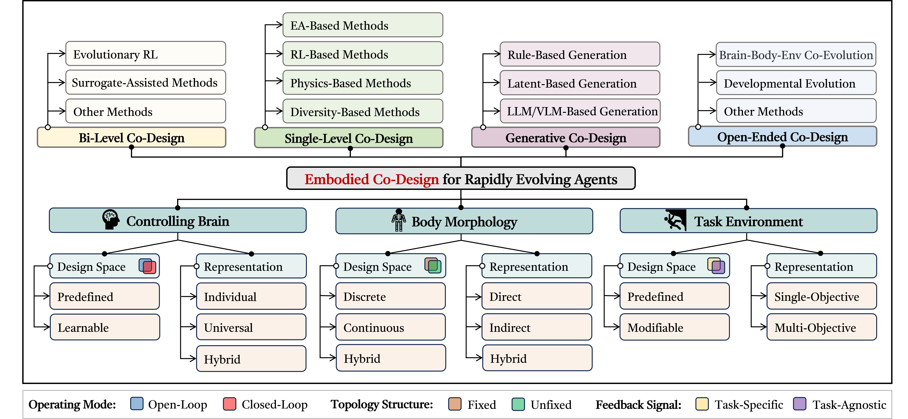
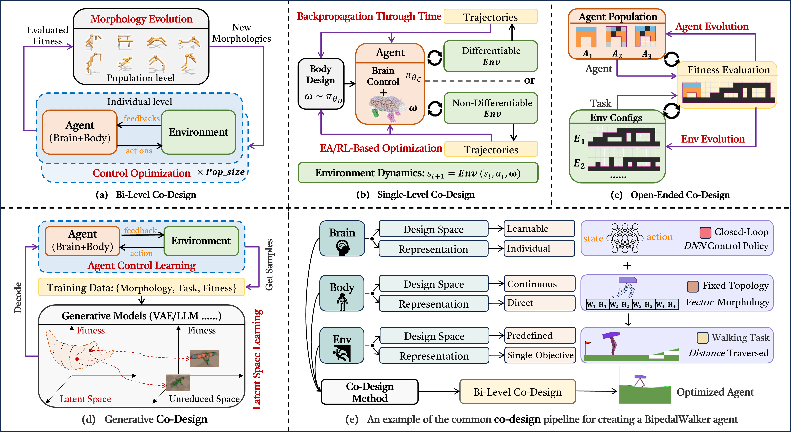

<div align=center></div>

<!-- [](https://arxiv.org/abs/1912.12033) -->
[](https://github.com/sindresorhus/awesome) 
[](https://github.com/Yuxing-Wang-THU/Awesome-Brain-Body-Co-Design-of-Embodied-Agents/graphs/commit-activity)
[](https://github.com/Yuxing-Wang-THU/Awesome-Brain-Body-Co-Design-of-Embodied-Agents/issues)
[](http://makeapullrequest.com)
[](https://github.com/Naereen/StrapDown.js/blob/master/LICENSE)


# 🚀 Brain-Body Co-Design for Embodied Agents: Taxonomy, Frontiers, and Challenges
<p style="text-align:justify;"> Human bodies have been carefully refined through the long process of evolution, enabling us to utilize our bodies to solve a multitude of tasks skillfully. This capability, natural to humans, remains challenging for embodied agents, such as robots. The difficulty arises because successful interactions are highly dependent on the synergy between brain, body, and environment. Recent breakthroughs in vision, language, and robotics have significantly improved the sensorimotor learning capabilities of embodied agents. Alongside the great potential of sensorimotor learning for understanding the world, the concept of <b>Brain-Body Co-Design (BBCD), namely, Automated Agent Design</b> has attracted considerable cross-disciplinary attention. Unlike traditional agent design approaches, which focus primarily on optimizing an agent’s control mechanism ("brain") while keeping its morphological structure ("body") and task configurations ("environment") fixed, BBCD emphasizes their simultaneous coordination, to design embodied agents that are not only structurally sound but also behaviorally adept.</p>

<div align=center></div>

<p style="text-align:justify;"><b>🔑 Contributions to Embodied AI:</b> This paper surveys recent advancements in BBCD within the context of embodied intelligence. We introduce a novel taxonomy that provides a structured analysis of the representations, co-design spaces, and optimization frameworks employed in state-of-the-art BBCD methods. We review notable benchmarks and applications of BBCD in simulated and real-world environments. We identify significant open challenges and offer insights into promising future research directions.

 We hope that this survey can serve as a reference-worthy and stimulating contribution to the advancement of embodied intelligence while also providing valuable perspectives for related fields.</p></b>

# 📋 Update List

**2025/01/01**: Happy New Year! I am updating the survey on this topic and will **fully** update the site when the survey is updated to Arxiv.

# 🔥 Comments
* [](http://makeapullrequest.com)Feel free to pull requests or contact us if you find any related papers that are not included here.
The process to submit a pull request is as follows:
- a. Fork the project into your own repository.
- b. Add the Title, Paper link, Published in, Agent Type, Page/Code link in `README.md` using the following format:
```python
  |[Title](Paper Link)|Conference/Journal/Preprint|Agent Type|[Code/Project](Code/Project Link)|
```
- c. Submit the pull request to this branch.

* **We will update this page on a regular basis! So stay tuned~ :tada::tada::tada:. If you do find our survey or the repository helpful, please consider kindly giving a :star:, 谢谢你, Thanks a lot, Спасибо, ありがとう, 감사합니다, Merci, Grazie, Obrigado, Danke, شكراً.**

# 🎥 Overview

<p style="text-align:justify;">
Here is a quick menu .^_^. : </p>
  
- [🚀 Brain-Body Co-Design for Embodied Agents: Taxonomy, Frontiers, and Challenges](#-brain-body-co-design-in-embodied-intelligence-taxonomy-frontiers-and-challenges)
- [📋 Update List](#-update-list)
- [🔥 Comments](#-comments)
- [🎥 Overview](#-overview)
	- [Taxonomy of BBCD](#taxonomy-of-bbcd)
	- [Optimization Frameworks of BBCD](#optimization-frameworks-of-bbcd)
- [:star: Latest Works](#star-latest-works)
- [:one: Bi-Level Brain-Body Co-Design](#one-bi-level-brain-body-co-design)
	- [ERL-Based Methods](#erl-based-methods)
	- [Surrogate-Based Methods](#surrogate-based-methods)
	- [Diversity-Based Methods](#diversity-based-methods)
	- [Other Methods](#other-methods)
- [:two: Single-Level Brain-Body Co-Design](#two-single-level-brain-body-co-design)
	- [EA-Based Methods](#ea-based-methods)
	- [RL-Based Methods](#rl-based-methods)
	- [Physics-Based Methods](#physics-based-methods)
	- [Other Methods](#other-methods-1)
- [:three: Generative Brain-Body Co-Design](#three-generative-brain-body-co-design)
	- [Rule-Based Generation](#rule-based-generation)
	- [Latent-Based Generation](#latent-based-generation)
	- [Large-Model-Based Generation](#large-model-based-generation)
- [:four: Open-Ended Co-Design Methods](#four-open-ended-co-design-methods)
	- [Co-Evolution Methods](#co-evolution-methods)
	- [Developmental Methods](#developmental-methods)
	- [Others](#others)
- [:five: Theoretical and Experimental Analysis of Brain-Body Co-Design](#five-theoretical-and-experimental-analysis-of-brain-body-co-design)
- [:computer: Simulated Benchmarks for Brain-Body Co-Design](#computer-simulated-benchmarks-for-brain-body-co-design)
- [:door: BBCD in Real World](#door-bbcd-in-real-world)
- [:book: Other Surveys Recommended](#book-other-surveys-recommended)
- [:envelope: Contact Information](#envelope-contact-information)

## Taxonomy of BBCD
<p style="text-align:justify;"> 

The creation of an embodied agent hinges on three critical components: <b>Brain (control)</b>, <b>Body (morphology)</b>, <b>Environment (task)</b>, and the <b>co-design algorithm (optimization)</b> that optimizes these components.</p>

<p style="text-align:justify;"><b>1. Brain (Control)</b>: The controller (software) is responsible for perception-action coupling, enabling an agent to process sensory information and generate appropriate motor responses to control its body.</p>

<p style="text-align:justify;"><b>2. Body (Morphology)</b>: The physical embodiment (hardware) of an agent, including its shape, material properties, sensor placement, etc. Morphological design determines the agent’s physical capabilities and constraints, thereby impacting its performance and adaptability.</p>

<p style="text-align:justify;"><b>3. Environment (Interaction constraints)</b>: This includes both task-specific conditions and broader environmental configurations. It not only defines the challenge faced by an agent but also provides the necessary feedback for learning and adaptation. Task requirements and environmental dynamics are crucial for shaping the agent’s behavior and learning objectives.</p>

<p style="text-align:justify;"><b>4. Co-Design Algorithm (A machine that can design other machines)</b>: An effective co-design algorithm integrates the optimization of control, morphology, and environmental interactions. Unlike traditional methods that treat these components separately, co-design algorithms aim to simultaneously refine all aspects, leading to more efficient and adaptive agents. These algorithms leverage advanced techniques to explore and exploit the co-design space, optimizing for performance across diverse tasks and environments.</p>

<div align=center></div>

<b>:book: We provide a detailed analysis of BBCD methods based on the proposed taxonomy. Please refer to our paper when it is available online.</b>

## Optimization Frameworks of BBCD
The following picture introduces 4 general BBCD frameworks, with the last sub-figure showing an example of the BBCD process for creating a BipedalWalker agent.
<div align=center></div>

# :star: Latest Works
|Paper| Published in |Co-Designed Agent|Code&Page|                               
|:---------|:---------------------------------------------------|:-------------:|:-------------|
|[RoboMorph: Evolving Robot Morphology using Large Language Models](https://arxiv.org/pdf/2407.08626?)|**Arxiv 2024**|Rigid-bodied Robot|-|
|[RoboNet: A Sample-Efficient Robot co-design Generator](https://openreview.net/pdf?id=VdT2R6XSlV)|**CoRLw 2024**|Rigid-bodied Robot|-|
|[LASeR: LASeR: Towards Diversified and Generalizable Robot Design with Large Language Models](https://openreview.net/forum?id=7mlvOHL6qJ)|**ICLR 2025**|Modular Soft Robot|[Code](https://github.com/WoodySJR/LASeR)|
|[Generating Freeform Endoskeletal Robots](https://arxiv.org/abs/2412.01036)|**ICLR 2025**|Endoskeletal Robot|[Code](https://github.com/iffiX/endoskeletal)&[Page](https://endoskeletal.github.io/)|
|[Accelerated co-design of robots through morphological pretraining](https://arxiv.org/pdf/2502.10862)|**Arxiv 2025**|Modular Robot|[Page](https://sites.google.com/view/co-design-mpt)|
|[BodyGen: Advancing Towards Efficient Embodiment Co-Design](https://arxiv.org/pdf/2503.00533)|**ICLR 2025**|Rigid-bodied Robot|[Page](https://genesisorigin.github.io/)&[Code](https://github.com/GenesisOrigin/BodyGen)|
|[RoboMoRe: LLM-based Robot Co-design via Joint Optimization of Morphology and Reward](https://arxiv.org/pdf/2506.00276?)|**Arxiv 2025**|Rigid-bodied Robot|-|
|[Efficient End-effector Co-Design by Demonstration for Deformable Fragile Object Manipulation](https://openreview.net/forum?id=zJKf0kpQTD)|**RSSw 2025**|End-effector|[Page](https://sites.google.com/view/efficient-end-effector-and-con/home)|
|[Cross-Task Collaborative Optimization Based on Knowledge Transfer for Soft Robot Design](https://ieeexplore.ieee.org/abstract/document/11015931)|**TEVC 2025**|Modular Soft Robot|-|
|[Controller Distillation Reduces Fragile Brain-Body Co-Adaptation and Enables Migrations in MAP-Elites](https://arxiv.org/pdf/2504.06523)|**GECCO 2025**|Modular Soft Robot|[Code](https://github.com/mertan-a/pollination)|
|[Accelerating Soft Robot Evolution Using N-gram-based Controller Inheritance and Genetic Co-Design](https://dl.acm.org/doi/abs/10.1145/3712255.3726568)|**GECCO 2025**|Modular Soft Robot|-|
|[Large Language Models as Natural Selector for Embodied Soft Robot Design](https://arxiv.org/pdf/2503.02249)|**Arxiv 2025**|Modular Soft Robot|[Code](https://github.com/AisenGinn/evogym_data_generation)|
|[VLMGINEER: Vision Language Models as Robotic Toolsmiths](https://arxiv.org/abs/2507.12644)|**Arxiv 2025**|Rigid-bodied Robot|[Page](https://vlmgineer.github.io/release)|
|[Evolutionary Brain-Body Co-Optimization Consistently Fails to Select for Morphological Potential](https://arxiv.org/abs/2508.17464)|**A-Life 2025**|Modular Soft Robot|[Code](https://github.com/mertan-a/morphology-fitness-landscape)|
|[Morphological Cognition: Classifying MNIST Digits Through Morphological Computation Alone](https://arxiv.org/abs/2508.17469)|**A-Life 2025**|Modular Soft Robot|[Code](https://github.com/mertan-a/morphological-cognition)|
|[Efficient co-adaptation of humanoid robot design and locomotion control using surrogate-guided optimization](https://www.sciencedirect.com/science/article/pii/S2667379725000464)|**Biomimetic Intelligence and Robotics**|Humanoid Robot|-|
|[Enhancing Adaptability in Embodied Agents: A Multi-Quality-Diversity Approach](https://ieeexplore.ieee.org/abstract/document/11119655)|**IEEE TEVC**|Modular Soft Robot|[Code](https://github.com/giorgia-nadizar/BBB-QD)|
|[A multi-objective optimization framework based on information sharing for serially connected robot design](https://link.springer.com/article/10.1007/s40747-025-02045-x)|**Complex & Intelligent Systems**|Modular Soft Robot|-|
|[Quality-diversity in problems with composite solutions: a case study on body–brain robot optimization](https://link.springer.com/article/10.1007/s10710-025-09520-x)|**Genetic Programming and Evolvable Machines**|Modular Soft Robot|-|
|[Soft yet Effective Robots via Holistic Co-Design](https://arxiv.org/pdf/2505.03761)|**Arxiv 2025**|Soft Robot|-|
|[The Morphology-Control Trade-Off: Insights into Soft Robotic Efficiency](https://arxiv.org/abs/2503.16127)|**Arxiv 2025**|Modular Soft Robot|-|
|[Modeling, Embedded Control and Design of Soft Robots using a Learned Condensed FEM Model](https://arxiv.org/pdf/2503.15009)|**IEEE TRO**|Soft Robot|-|
|[Selection pressure shapes epistatic gene interactions in the evolution of robots](https://osf.io/ecpfw/download)|-|Modular Robot|[code](https://github.com/karinemiras/revolve2/tree/plasticoding_v3)|
|[TE-RoboNet: Transfer Enhanced RoboNet for Sample-Efficient Generation of Robot Co-Designs](https://openreview.net/forum?id=sbjbD8ftCH)|**EWRL 2025**|Rigid Robot||
|[Co-Design and Control of a Biomimetic Snake Robot and its Contact Surfaces with Reinforcement Learning](https://openreview.net/forum?id=fUdHUU2ZCV)|**EWRL 2025**|Snake Robot||
|[COGENT: Co-design of Robots with GFlowNets](https://openreview.net/forum?id=IfLKMWrroL)|**EWRL 2025**|Modular Robot||
# :one: Bi-Level Brain-Body Co-Design
<div align=center></div>

## ERL-Based Methods
<b>TLDR: Methods that focus on the bi-level nature of control learning together with morphology evolution (Baldwin Effect)</b>

|Paper| Published in |Co-Designed Agent|Code&Page|                               
|:---------|:---------------------------------------------------|:-------------:|:-------------|
[Neural graph evolution: Towards efficient automatic robot design](https://arxiv.org/pdf/1906.05370)|**ICLR 2019**|Rigid-bodied Robot|[Code](https://github.com/WilsonWangTHU/neural_graph_evolution)&[Page](https://www.cs.toronto.edu/~henryzhou/NGE_website/)|
[Embodied Intelligence via Learning and Evolution](https://www.nature.com/articles/s41467-021-25874-z)|**Nature Comm. 2021**|Rigid-bodied Robot|[Code](https://github.com/agrimgupta92/derl)&[Page](https://hai.stanford.edu/news/how-bodies-get-smarts-simulating-evolution-embodied-intelligence)|
[Evolution Gym: A Large-Scale Benchmark for Evolving Soft Robots](https://arxiv.org/pdf/2201.09863)|**NIPS 2021**|Modular Soft Robot|[Code](https://github.com/EvolutionGym/evogym)&[Page](https://evolutiongym.github.io/)|
[Evolving Physical Instinct for Morphology and Control Co-Adaption](https://ieeexplore.ieee.org/document/10342243)|**IROS 2023**|Legged Robot|[Code](https://github.com/HPCL-EI/InstinctEvolution)|
[GA-based Co-Design Algorithm with Successive Halving](https://ieeexplore.ieee.org/document/10371512)|**IIAI-AAI 2023**|Modular Soft Robot|-|
[Leveraging Hyperbolic Embeddings for Coarse-to-Fine Robot Design](https://arxiv.org/abs/2311.00462v2)|**ICLR 2024**|Modular Soft Robot|[Code](https://github.com/drdh/HERD)&[Page](https://sites.google.com/view/hyperbolic-robot-design)|
[Structural Optimization of Lightweight Bipedal Robot via SERL](https://serl-iros2024.github.io/paper.pdf)|**IROS 2024**|Modular Soft Robot|[Code](https://github.com/drdh/HERD)&[Page](https://sites.google.com/view/hyperbolic-robot-design)|
[Text2Robot: Evolutionary Robot Design from Text Descriptions](https://arxiv.org/pdf/2406.19963)|**Arxiv 2024**|Legged Robot|[Code](https://github.com/generalroboticslab/Text2Robot)&[Page](http://www.generalroboticslab.com/blogs/blog/2024-06-28-text2robot/index.html)|
[A Morphological Transfer-Based Multi-Fidelity Evolutionary Algorithm for Soft Robot Design](https://ieeexplore.ieee.org/document/10709670/)|**IEEE CIM 2024**|Modular Soft Robot|[Code](https://github.com/HandingWangXDGroup/mtmfea)|
[Lamarckian Co-design of Soft Robots via Transfer Learning](https://dl.acm.org/doi/10.1145/3638529.3654180)|**GECCO 2024**|Modular Soft Robot|[Code](https://github.com/kazukazupi/LamarckianSoftRobot)|
[Evolution-Based Shape and Behavior Co-Design of Virtual Agents](https://ieeexplore.ieee.org/document/10403977)|**TVCG 2024**|Rigid-bodied Robot|-|
[ECoDe: A Sample-Efficient Method for Co-design of Robotic Agents](https://arxiv.org/pdf/2309.04085v2)|**AI 2024**|Rigid-bodied Robot|[Page](https://n-kish.github.io/ecode/)|
[Following Ancestral Footsteps: Co-Designing Agent Morphology and Behaviour with Self-Imitation Learning](https://openreview.net/forum?id=lHlhqoWfjw)|**EARL 2024**| Rigid-bodied Robot|[Code](https://github.com/serhez/cosil)&[Page](https://sites.google.com/view/self-co-imitation)|
[Learn and evolve to optimize robot morphologies](https://www.spiedigitallibrary.org/conference-proceedings-of-spie/13224/132240F/Learn-and-evolve-to-optimize-robot-morphologies/10.1117/12.3034893.short)|**IoTSC 2024**| Rigid-bodied Robot|-|
[Generating Freeform Endoskeletal Robots](https://arxiv.org/pdf/2412.01036)|**ICLR 2025**|Endoskeletal Robot|[Code](https://github.com/iffiX/endoskeletal)&[Page](https://endoskeletal.github.io/)|
|[A multi-objective optimization framework based on information sharing for serially connected robot design](https://link.springer.com/article/10.1007/s40747-025-02045-x)|**Complex & Intelligent Systems**|Modular Soft Robot|-|
|[Accelerating Soft Robot Evolution Using N-gram-based Controller Inheritance and Genetic Co-Design](https://dl.acm.org/doi/abs/10.1145/3712255.3726568)|**GECCO 2025**|Modular Soft Robot|-|

## Surrogate-Based Methods
<b>TLDR: Methods that focus on using surrogate models to reduce the computational burden of the co-design process (how to efficiently evaluate a morphology without learning a specific controller?)</b>

|Paper| Published in |Co-Designed Agent|Code&Page|                               
|:---------|:---------------------------------------------------|:-------------:|:-------------|
[The trade-off between morphology and control in the co-optimized design of robots](https://journals.plos.org/plosone/article/file?id=10.1371/journal.pone.0186107&type=printable)|**PLOS ONE 2017**|Rigid-bodied Robot|-|
[Data-efficient Learning of Morphology and Controller for a Microrobot](https://arxiv.org/pdf/1905.01334)|**ICRA 2019**|Micro Robot|[Code](https://github.com/tholiao/learning-morph-and-ctrl)&[Page](https://sites.google.com/view/learning-robot-morphology)|
[Data-efficient co-adaptation of morphology and behaviour with deep reinforcement learning](https://arxiv.org/pdf/1911.06832)|**CoRL 2020**|Rigid-bodied Robot|[Code](https://github.com/ksluck/Coadaptation)|
[What robot do i need? fast co-adaptation of morphology and control using graph neural networks](https://arxiv.org/pdf/2111.02371)|**Arxiv 2021**|Rigid-bodied Robot|-|
[Evolution Gym: A Large-Scale Benchmark for Evolving Soft Robots](https://arxiv.org/pdf/2201.09863)|**NIPS 2021**|Modular Soft Robot|[Code](https://github.com/EvolutionGym/evogym)&[Page](https://evolutiongym.github.io/)|
[Co-imagination of Behaviour and Morphology of Agents](https://kevin-luck.com/assets/pdf/Sliacka_LOD_2024.pdf)|**LOD 2023**|Rigid-bodied Robot|-|
[Co-imitation: learning design and behaviour by imitation](https://arxiv.org/pdf/2209.01207)|**AAAI 2023**|Rigid-bodied Robot|[Page](https://sites.google.com/view/co-imitation)|
[Rapidly evolving soft robots via action inheritance](https://ieeexplore.ieee.org/document/10296048)|**TEVC 2023**|Modular Soft Robot|[Code](https://github.com/ShuleiLiu/AIEA)|
[Co-Designing Tools and Control Policies for Robust Manipulation](https://arxiv.org/pdf/2409.11113)|**Arxiv 2024**|Rigid Tool|[Page](https://sites.google.com/view/robust-codesign/)|
[Effective Design and Interpretation in Voxel-Based Soft Robotics: A Part Assembly Approach with Bayesian Optimization](https://direct.mit.edu/isal/proceedings/isal2024/36/26/123476)|**GECCO 2024**|Modular Soft Robot|-|
|[Efficient co-adaptation of humanoid robot design and locomotion control using surrogate-guided optimization](https://www.sciencedirect.com/science/article/pii/S2667379725000464)|**Biomimetic Intelligence and Robotics**|Humanoid Robot|-|

## Diversity-Based Methods
<b>TLDR: Methods that focus on generating morphological diversity (how to effectively keep the morphological diversity?).</b>

|Paper| Published in |Co-Designed Agent|Code&Page|                               
|:---------|:---------------------------------------------------|:-------------:|:-------------|
[A ’MAP’ to find high-performing soft robot designs: Traversing complex design spaces using MAP-elites and Topology Optimization](https://arxiv.org/pdf/2407.07591)|**IROS 2024**|Rigid Manipulator|N/A|
|[Controller Distillation Reduces Fragile Brain-Body Co-Adaptation and Enables Migrations in MAP-Elites](https://arxiv.org/pdf/2504.06523)|**GECCO 2025**|Modular Soft Robot|[Code](https://github.com/mertan-a/pollination)|
|[Enhancing Adaptability in Embodied Agents: A Multi-Quality-Diversity Approach](https://ieeexplore.ieee.org/abstract/document/11119655)|**IEEE TEVC**|Modular Soft Robot|[Code](https://github.com/giorgia-nadizar/BBB-QD)|
|[Quality-diversity in problems with composite solutions: a case study on body–brain robot optimization](https://link.springer.com/article/10.1007/s10710-025-09520-x)|**Genetic Programming and Evolvable Machines**|Modular Soft Robot|-|

## Other Methods
|Paper| Published in |Co-Designed Agent|Code&Page|                               
|:---------|:---------------------------------------------------|:-------------:|:-------------|
[Task-Agnostic Morphology Evolution](https://openreview.net/pdf?id=CGQ6ENUMX6)|**ICLR 2021**|Rigid-bodied Robot|[Code](https://github.com/jhejna/morphology-opt)&[Page](https://sites.google.com/view/task-agnostic-evolution)| -->
[Codesign of humanoid robots for ergonomic collaboration with multiple humans via genetic algorithms and nonlinear optimization](https://ieeexplore.ieee.org/document/10375237)|**Humanoids 2023**|Humanoid Robot|[Code](https://github.com/ami-iit/paper_sartore_2023_humanoids_codesign-ga-nl)|
[Evolution and learning in differentiable robots](https://www.roboticsproceedings.org/rss20/p100.pdf)|**RSS 2024**|Modular Soft Robot|[Code](https://github.com/lstrgar/ELDiR)&[Page](https://sites.google.com/view/eldir)|
[Improving Efficiency of Evolving Robot Designs via Self-Adaptive Learning Cycles and an Asynchronous Architecture](https://dl.acm.org/doi/pdf/10.1145/3638530.3664116)|**GECCO 2024**| Modular Rigid Robot|-|

# :two: Single-Level Brain-Body Co-Design
<div align=center></div>

## EA-Based Methods
<b>TLDR: Methods that focus on evolving morphology and control simultaneously (how does natural evolution inform the co-design process?).</b>

|Paper| Published in |Co-Designed Agent|Code&Page|                               
|:---------|:---------------------------------------------------|:-------------:|:-------------|
|[Evolving 3D morphology and behavior by competition](https://citeseerx.ist.psu.edu/document?repid=rep1&type=pdf&doi=625cf770e697cc01b9201fd3b67456ac56a7a27b)|**ALife 1994**|Rigid-bodied Robot|-|
|[Automatic design and manufacture of robotic lifeforms](http://129.64.46.116/pr/golem/download/naturegolem.pdf)|**Nature 2000**|Rigid-bodied Robot|-|
|[Evolving Complete Agents using Artificial Ontogeny](https://www.lri.fr/~waller/cours/fr/articles/2008/schoenauer_robot1.pdf)|**Morph 2003**|Rigid-bodied Robot|-|
|[Generative representations for the automated design of modular physical robots](https://ntrs.nasa.gov/api/citations/20030107313/downloads/20030107313.pdf)|**TRA 2004**|Rigid-bodied Robot|-|
|[An Improved System for Artificial Creatures Evolution](https://citeseerx.ist.psu.edu/document?repid=rep1&type=pdf&doi=2d64f5e208b2e841dfc30ea6daffb4e259bae75f)|**ALife 2006**|Rigid-bodied Robot|-|
|[Evolving virtual creatures and catapults](https://ieeexplore.ieee.org/abstract/document/6792861)|**ALife 2007**|Rigid-bodied Robot|-|
|[Solving deceptive tasks in robot body-brain co-evolution by searching for behavioral novelty](https://ieeexplore.ieee.org/abstract/document/5687250)|**ICISDA 2010**|Rigid-bodied Robot|-|
[A Unified Substrate for Body-Brain Co-evolution](https://arxiv.org/pdf/2203.12066)|**ICLRw 2022**|Vitual Creature|[Code](https://github.com/sidneyp/neural-cellular-robot-substrate)|
|[Evolution of Developmental Plasticity of Soft Virtual Creatures in Changing Environments](https://ieeexplore.ieee.org/document/10611998)|**CEC 2024**|Modular Soft Robot|N/A|

## RL-Based Methods
<b>TLDR: Methods that focus on optimizing morphology and control simultaneously using Reinforcement Learning (physics-model free).</b>

|Paper| Published in |Co-Designed Agent|Code&Page|                               
|:---------|:---------------------------------------------------|:-------------:|:-------------|
|[Reinforcement learning for improving agent design](https://direct.mit.edu/artl/article/25/4/352/93262/Reinforcement-Learning-for-Improving-Agent-Design)|**A-LIFE 2019**|Rigid-bodied Robot|[Page](https://designrl.github.io/)|
|[Learning to Fly: Computational Controller Design for Hybrid UAVs with Reinforcement Learning](https://dl.acm.org/doi/10.1145/3306346.3322940)|**ACM TOG 2019**|UAV|-|
|[Jointly learning to construct and control agents using deep reinforcement learning](https://arxiv.org/pdf/1801.01432)|**ICRA 2019**|Rigid-bodied Robot|[Page](https://home.ttic.edu/~cbschaff/nlimb/)&[Code](https://github.com/cbschaff/nlimb)|
|[Learning to control self-assembling morphologies: a study of generalization via modularity](https://proceedings.neurips.cc/paper_files/paper/2019/file/c26820b8a4c1b3c2aa868d6d57e14a79-Paper.pdf)|**NIPS 2019**|Modular Rigid Robot|[Page](https://pathak22.github.io/modular-assemblies/)&[Code](https://github.com/pathak22/modular-assemblies/)|
|[Hardware as policy: Mechanical and computational co-optimization using deep reinforcement learning](https://arxiv.org/abs/2008.04460)|**CoRL 2020**|Rigid-bodied Robot|[Page](https://roamlab.github.io/hwasp/)|
|[Soft robots learn to crawl: Jointly optimizing design and control with sim-to-real transfer](https://arxiv.org/abs/2202.04575)|**RSS 2022**|Soft Robot|[Page](https://sites.google.com/ttic.edu/evolving-soft-robots)&[Code](https://github.com/cbschaff/evolving-soft-robots)|
|[Transform2act: Learning a transform-and-control policy for efficient agent design](https://proceedings.neurips.cc/paper_files/paper/2019/file/c26820b8a4c1b3c2aa868d6d57e14a79-Paper.pdf)|**ICLR 2022**|Rigid-bodied Robot|[Page](https://sites.google.com/view/transform2act)&[Code](https://github.com/Khrylx/Transform2Act)|
|[N-LIMB: Neural Limb Optimization for Efficient Morphological Design](https://proceedings.neurips.cc/paper_files/paper/2019/file/c26820b8a4c1b3c2aa868d6d57e14a79-Paper.pdf)|**Arxiv 2022**|Rigid-bodied Robot|[Page](https://sites.google.com/ttic.edu/nlimb)&[Code](https://github.com/cbschaff/nlimb2)|
|[Curriculum-based co-design of morphology and control of voxel-based soft robots](https://openreview.net/pdf?id=r9fX833CsuN)|**ICLR 2023**|Modular Soft Robot|[Code](https://github.com/Yuxing-Wang-THU/ModularEvoGym)&[Page](https://yuxing-wang-thu.github.io/projects/1_project/)|
|[PreCo: Enhancing Generalization in Co-Design of Modular Soft Robots via Brain-Body Pre-Training](https://proceedings.mlr.press/v229/wang23b/wang23b.pdf)|**CoRL 2023**|Modular Soft Robot|[Code](https://github.com/Yuxing-Wang-THU/ModularEvoGym)&[Page](https://yuxing-wang-thu.github.io/projects/1_project/)|
|[Learning to Design and Use Tools for Robotic Manipulation](https://arxiv.org/pdf/2311.00754)|**CoRL 2023**|Robot Manipulator Tools|[Page](https://robotic-tool-design.github.io/)|
|[MORPH: Design Co-optimization with Reinforcement Learning via a Differentiable Hardware Model Proxy](https://arxiv.org/pdf/2309.17227)|**Arxiv 2023**|Rigid-bodied robot|[Page](https://roamlab.github.io/morph/)|
|[Symmetry-Aware Robot Design with Structured Subgroups](https://proceedings.mlr.press/v202/dong23h/dong23h.pdf)|**ICML 2023**|Rigid-bodied robot|[Code](https://github.com/drdh/SARD)&[Page](https://sites.google.com/view/robot-design)|
|[CompetEvo: Towards Morphological Evolution from Competition](https://arxiv.org/pdf/2405.18300)|**IJCAI 2024**|Rigid bodied Robot|[Code](https://github.com/KJaebye/competevo)&[Page](https://competevo.github.io/)|
|[Reinforcement learning for freeform robot design](https://arxiv.org/pdf/2310.05670)|**ICRA 2024**|Modular Soft Robot|[Code](https://github.com/iffiX/RL4design)&[Page](https://www.youtube.com/watch?v=ybaEVDGvkTE)|
|[BodyGen: Advancing Towards Efficient Embodiment Co-Design](https://arxiv.org/pdf/2503.00533)|**ICLR 2025**|Rigid-bodied Robot|[Page](https://genesisorigin.github.io/)&[Code](https://github.com/GenesisOrigin/BodyGen)|
|[Efficient End-effector Co-Design by Demonstration for Deformable Fragile Object Manipulation](https://openreview.net/forum?id=zJKf0kpQTD)|**RSSw 2025**|End-effector|[Page](https://sites.google.com/view/efficient-end-effector-and-con/home)|
|[Co-Design and Control of a Biomimetic Snake Robot and its Contact Surfaces with Reinforcement Learning](https://openreview.net/forum?id=fUdHUU2ZCV)|**EWRL 2025**|Snake Robot||
## Physics-Based Methods
<b>TLDR: Methods that focus on optimizing morphology and control simultaneously using Differentiable Simulation (physics-model based).</b>

|Paper| Published in |Co-Designed Agent|Code&Page|                               
|:---------|:---------------------------------------------------|:-------------:|:-------------|
|[Learning-in-the-loop optimization: End-to-end control and co-design of soft robots through learned deep latent representations](https://proceedings.neurips.cc/paper/2019/file/438124b4c06f3a5caffab2c07863b617-Paper.pdf)|**NIPS 2019**|Soft Robot|-|
|[Diffaqua: A differentiable computational design pipeline for soft underwater swimmers with shape interpolation](https://dl.acm.org/doi/pdf/10.1145/3450626.3459832)|**ACM TOG 2021**|Soft Gripper|[Code](https://github.com/mit-gfx/DiffAqua)&[Page](https://proceedings.neurips.cc/paper/2019/hash/438124b4c06f3a5caffab2c07863b617-Abstract.html)|
|[Softzoo: A soft robot co-design benchmark for locomotion in diverse environments](https://openreview.net/pdf?id=Xyme9p1rpZw)| **ICLR 2023**|Soft Robot|[Code](https://github.com/zswang666/softzoo)&[Page](https://sites.google.com/view/softzoo-iclr-2023)|
|[4D topology optimization: Integrated optimization of the structure and self-actuation of soft bodies for dynamic motions](https://arxiv.org/pdf/2302.00905)|**Computer Methods in Applied Mechanics and Engineering 2023**|Soft Robot|N/A|
|[DiffuseBot: Breeding Soft Robots With Physics-Augmented Generative Diffusion Models](https://arxiv.org/pdf/2302.00905)|**NIPS 2023**|Soft Robot|[Code](https://github.com/EvolutionGym/evogym)&[Page](https://diffusebot.github.io/)|
|[Differentiable Soft-Robot Generation](https://dl.acm.org/doi/10.1145/3583131.3590408)|**GECCO 2023**|Soft Robot|N/A|
|[Topology optimization of locomoting soft bodies using material point method](https://arxiv.org/pdf/2203.16793)|**Structural and Multidisciplinary Optimization 2023**|Soft Robot|N/A|
|[Task2Morph: Differentiable Task-inspired Framework for Contact-Aware Robot Design](https://arxiv.org/pdf/2403.19093)|**IROS 2023**|Rigid Robot hand|[Code](https://github.com/Caiyishuai/Task2Morph)|
|[Evolution and learning in differentiable robots](https://arxiv.org/pdf/2405.14712)|**RSS 2024**|Rigid Robot|[Code](https://github.com/lstrgar/ELDiR)&[Page](https://sites.google.com/view/eldir)|
|[Computational co-design of structure and feedback controller for locomoting soft robots](https://arxiv.org/pdf/2407.09270)|**Arxiv 2024**|Soft Robot|[N/A]|
|[Making use of design-aware policy optimization in legged-robotics co-design](https://openreview.net/pdf?id=utaVaqRVO4)|**Workshop@CoRL 2024**|Legged Robot|N/A|
|[Computational synthesis of locomotive soft robots by topology optimization](https://www.science.org/doi/pdf/10.1126/sciadv.adn6129)|**Science Advances 2024**|Soft Robot|N/A|
|[Accelerated co-design of robots through morphological pretraining](https://arxiv.org/pdf/2502.10862)|**Arxiv 2025**|Modular Robot|[Page](https://sites.google.com/view/co-design-mpt)|
|[Modeling, Embedded Control and Design of Soft Robots using a Learned Condensed FEM Model](https://arxiv.org/pdf/2503.15009)|**IEEE TRO**|Soft Robot|-|

## Other Methods

# :three: Generative Brain-Body Co-Design
<div align=center></div>

## Rule-Based Generation
<b>TLDR: Methods that focus on generating agent morphologies using rule-based systems (grammar, L-systems, etc.).</b>

|Paper| Published in |Co-Designed Agent|Code&Page|                               
|:---------|:---------------------------------------------------|:-------------:|:-------------|
|[Generative representations for the automated design of modular physical robots](https://ntrs.nasa.gov/api/citations/20030107313/downloads/20030107313.pdf)|**TRA 2004**|Rigid-bodied Robot|-|
[Robogrammar: graph grammar for terrain-optimized robot design](https://dl.acm.org/doi/10.1145/3414685.3417831)|**TOG 2020**|Rigid-bodied Robot|[Code](https://github.com/allanzhao/RoboGrammar)&[Page](https://people.csail.mit.edu/jiex/papers/robogrammar/index.html)|
[Automatic Co-Design of Aerial Robots Using a Graph Grammar](https://cfg.mit.edu/assets/images/ieee-xplore-full-text-pdf-.pdf)|**IROS 2022**|UAV|-|
|[Synergizing Morphological Computation and Generative Design: Automatic Synthesis of Tendon-Driven Grippers](https://arxiv.org/pdf/2410.07865) |**IROS 2024**|Tendon-Driven Grippers|[Code](https://github.com/aimclub/rostok)&[Page](https://rostok.readthedocs.io/en/latest/)|

## Latent-Based Generation
<b>TLDR: Methods that focus on generating agent morphologies using latent-based systems (GAN, VAE, etc.).</b>

|Paper| Published in |Co-designed Agent|Code&Page|                               
|:---------|:---------------------------------------------------|:-------------:|:-------------|
[GLSO: Grammar-guided Latent Space Optimization for Sample-efficient Robot Design Automation](https://proceedings.mlr.press/v205/hu23c/hu23c.pdf)|**CoRL 2022**|Rigid-Bodied Robot|[Code](https://github.com/JiahengHu/GLSO)|
|[Modular Robot Design Optimization with Generative Adversarial Networks](https://ieeexplore.ieee.org/abstract/document/9812091)|**ICRA 2022**|Modular Rigid Robot|-|
|[MorphVAE: Advancing Morphological Design of Voxel-Based Soft Robots with Variational Autoencoders](https://ojs.aaai.org/index.php/AAAI/article/view/28904)|**AAAI 2024**|Modular Soft Robot|[Code](https://github.com/WoodySJR/MorphVAE)|
|[RoboNet: A Sample-Efficient Robot co-design Generator](https://openreview.net/pdf?id=VdT2R6XSlV)|**CoRLw 2024**|Rigid-bodied Robots|-|
|[Generating Freeform Endoskeletal Robots](https://arxiv.org/abs/2412.01036)|**ICLR 2025**|Endoskeletal Robots|[Code](https://github.com/iffiX/endoskeletal)&[Page](https://endoskeletal.github.io/)|
|[TE-RoboNet: Transfer Enhanced RoboNet for Sample-Efficient Generation of Robot Co-Designs](https://openreview.net/forum?id=sbjbD8ftCH)|**EWRL 2025**|Rigid Robot||
|[COGENT: Co-design of Robots with GFlowNets](https://openreview.net/forum?id=IfLKMWrroL)|**EWRL 2025**|Modular Robot||

## Large-Model-Based Generation
<b>TLDR: Methods that focus on generating agent morphologies using large models (Diffusion Model, LLM, etc.).</b>

|Paper| Published in |Co-Designed Agent|Code&Page|                               
|:---------|:---------------------------------------------------|:-------------:|:-------------|
|[Evolution Through Large Models](https://arxiv.org/abs/2206.08896)|**Arxiv 2023**|Robot Gripper|[Code](https://github.com/CarperAI/OpenELM)|
|[How can LLMs transform the robotic design process?](https://www.nature.com/articles/s42256-023-00669-7)|**Nature Machine Intelligence 2023**|Robot Gripper|-|
|[DiffuseBot: Breeding Soft Robots With Physics-Augmented Generative Diffusion Models](https://arxiv.org/pdf/2302.00905)|**NIPS 2023**|Soft Robot|[Code](https://github.com/EvolutionGym/evogym)&[Page](https://diffusebot.github.io/)|
|[LLM-POET: Evolving Complex Environments using Large Language Models](https://arxiv.org/pdf/2406.04663)|**GECCO 2024 Companion**|Modular soft robot|N/A|
|[RoboMorph: Evolving Robot Morphology using Large Language Models](https://arxiv.org/pdf/2407.08626?)|**Arxiv 2024**|Rigid-bodied Robot|-|
|[LASeR: LASeR: Towards Diversified and Generalizable Robot Design with Large Language Models](https://openreview.net/forum?id=7mlvOHL6qJ)|**ICLR 2025**|Modular Soft Robot|[Code](https://github.com/WoodySJR/LASeR)|
|[RoboMoRe: LLM-based Robot Co-design via Joint Optimization of Morphology and Reward](https://arxiv.org/pdf/2506.00276?)|**Arxiv 2025**|Rigid-bodied Robot|-|
|[Large Language Models as Natural Selector for Embodied Soft Robot Design](https://arxiv.org/pdf/2503.02249)|**Arxiv 2025**|Modular Soft Robot|[Code](https://github.com/AisenGinn/evogym_data_generation)|

# :four: Open-Ended Co-Design Methods
<div align=center></div>

## Co-Evolution Methods
<b>TLDR: Methods that focus on brain-body-environment co-optimization.</b>

|Paper| Published in |Co-Designed Agent|Code&Page|                               
|:---------|:---------------------------------------------------|:-------------:|:-------------|
|[Co-Designing Manipulation Systems Using Task-Relevant Constraints](https://www.static.tu.berlin/fileadmin/www/10002220/Publications/Vaish-22-ICRA.pdf)|**ICRA 2022**|Rigid Manipulator|N/A|
|[Curriculum Reinforcement Learning via Morphology-Environment Co-Evolution](https://arxiv.org/pdf/2309.12529)|**Arxiv 2023**|Rigid-bodied Robot|N/A|
|[Task2Morph: Differentiable Task-inspired Framework for Contact-Aware Robot Design](https://ieeexplore.ieee.org/document/10341360)|**IROS 2023**|Rigid-bodied Robot|[Code](https://github.com/HPCL-EI/Task2Morph)|
|[Brain–body-task co-adaptation can improve autonomous learning and speed of bipedal walking](https://iopscience.iop.org/article/10.1088/1748-3190/ad8419/pdf)|**Bioinspir. Biomim. 2024**|Legged Robot|N/A|
|[LLM-POET: Evolving Complex Environments using Large Language Models](https://arxiv.org/pdf/2406.04663)|**GECCO 2024 Companion**|2D Modular Soft Robot</br>(Voxel-Based Soft Robot)|N/A|
|[Evolving Complex Environments in Evolution Gym using Large Language Models](https://ieeexplore.ieee.org/abstract/document/10626609)|**ICASSPW 2024**|2D Modular Soft Robot</br>(Voxel-Based Soft Robot)|N/A|
|[Task-Based Design and Policy Co-Optimization for Tendon-driven Underactuated Kinematic Chains](https://arxiv.org/pdf/2405.14566)|**Arxiv 2024**|Rigid Manipulator|[Page](https://roamlab.github.io/tentamorph/)|

## Developmental Methods

## Others 
<b>TLDR: Actuating Shape-Changed robots.</b>

|Paper| Published in |Co-Designed Agent|Code&Page|                               
|:---------|:---------------------------------------------------|:-------------:|:-------------|
|[Shape change and control of pressure-based soft agents](https://direct.mit.edu/isal/proceedings/isal2022/34/37/112294)|**ALIFE 2022**|Pressure-Based Soft Robot|[Code](https://github.com/pigozzif/PressureSoftAgents)&[Page](https://pressuresoftagents.github.io/)|
|[DittoGym: Learning to Control Soft Shape-Shifting Robots](https://arxiv.org/pdf/2401.13231)|**ICLR 2024**|Soft Shape-Shifting Robots|[Code](https://github.com/suninghuang19/dittogym)&[Page](https://dittogym.github.io/)|

# :five: Theoretical and Experimental Analysis of Brain-Body Co-Design
<b>TLDR: Papers that investigates the synergy of Brain, Body, and Environment.</b>

|Paper| Published in |Co-Designed Agent|Code&Page| 
|:---------|:---------------------------------------------------|:-------------:|:-------------|
|[A comparative analysis on genome pleiotropy for evolved soft robots](https://dl.acm.org/doi/abs/10.1145/3520304.3528977) |**GECCO 2022**|3D Modular Soft Robot|[Code](https://github.com/Co-Evolve/genome-pleiotropy)|
[Subtract to adapt: Autotomic robots](https://par.nsf.gov/servlets/purl/10492896)|**RoboSoft 2023**|Modular Soft Robot|N/A|
[A comparison of controller architectures and learning mechanisms for arbitrary robot morphologies](https://arxiv.org/pdf/2309.13908)|**SSCI 2023**|Modular Rigid Robot|N/A|
[How Perception, Actuation, and Communication Impact the Emergence of Collective Intelligence in Simulated Modular Robots](https://ieeexplore.ieee.org/document/10791479)|**ALIFE 2024**|Modular Robot|N/A|
[Co-Optimization of Robot Design and Control: Enhancing Performance and Understanding Design Complexity](https://arxiv.org/pdf/2409.08621)|**Arxiv 2024**|-|[Code](https://github.com/EtorArza/NestedOpt)|
|[Investigating Premature Convergence in Co-optimization of Morphology and Control in Evolved Virtual Soft Robots](https://books.google.com.hk/books?hl=zh-CN&lr=&id=Y4f9EAAAQBAJ&oi=fnd&pg=PA38&ots=IjMl3-hZx0&sig=JnsRuJQAu0ksg_AOW7c0GxXUG1I&redir_esc=y#v=onepage&q&f=false)|**EuroGP 2024**|Modular Soft Robot|N/A|
|[Evolutionary Brain-Body Co-Optimization Consistently Fails to Select for Morphological Potential](https://arxiv.org/abs/2508.17464)|**A-Life 2025**|Modular Soft Robot|[Code](https://github.com/mertan-a/morphology-fitness-landscape)|
|[Morphological Cognition: Classifying MNIST Digits Through Morphological Computation Alone](https://arxiv.org/abs/2508.17469)|**A-Life 2025**|Modular Soft Robot|[Code](https://github.com/mertan-a/morphological-cognition)|
|[The Morphology-Control Trade-Off: Insights into Soft Robotic Efficiency](https://arxiv.org/abs/2503.16127)|**Arxiv 2025**|Modular Soft Robot|-|
|[Selection pressure shapes epistatic gene interactions in the evolution of robots](https://osf.io/ecpfw/download)|-|Modular Robot|[code](https://github.com/karinemiras/revolve2/tree/plasticoding_v3)|

# :computer: Simulated Benchmarks for Brain-Body Co-Design

|Platform|Related Papers|Agent|Differentiable Sim|                              
|:---------|:--------------------------------------------|:-------------:|:--:|
|**Evolution Gym**</br>[Code](https://github.com/EvolutionGym/evogym)&[Page](https://evolutiongym.github.io/)</br>**ModularEvoGym**</br>[Code](https://github.com/Yuxing-Wang-THU/ModularEvoGym)&[Page](https://github.com/Yuxing-Wang-THU/ModularEvoGym)|[Evolution gym: A large-scale benchmark for evolving soft robots (NIPS 2021)](https://arxiv.org/abs/2201.09863)</br>1. [PreCo: Enhancing Generalization in Co-Design of Modular Soft Robots via Brain-Body Pre-Training (CoRL 2023)](https://proceedings.mlr.press/v229/wang23b/wang23b.pdf)</br>2. [Rapidly Evolving Soft Robots via Action Inheritance (IEEE TEC 2024)](https://ieeexplore.ieee.org/abstract/document/10296048)</br>3. [How the morphology encoding influences the learning ability in body-brain co-optimization (GECCO 2023)](https://arts.units.it/retrieve/38193007-3420-4082-8af5-9de6a3385725/2023-GECCO-MorphologyEncodingLearningInVSRs-Post_print.pdf)</br>4. [Curriculum-based co-design of morphology and control of voxel-based soft robots (ICLR 2023)](https://openreview.net/pdf?id=r9fX833CsuN)</br>5. [Co-evolving morphology and control of soft robots using a single genome (SSCI 2022)](https://arxiv.org/pdf/2212.11517)</br>6. [A Morphological Transfer-Based Multi-Fidelity Evolutionary Algorithm for Soft Robot Design (IEEE CIM 2024)](https://ieeexplore.ieee.org/abstract/document/10709670)</br>7. [Lamarckian Co-design of Soft Robots via Transfer Learning (GECCO 2024)](https://dl.acm.org/doi/abs/10.1145/3638529.3654180)</br>8. [Investigating Premature Convergence in Co-optimization of Morphology and Control in Evolved Virtual Soft Robots (EuroGP 2024)](https://arxiv.org/pdf/2402.09231)</br>9. [MorphVAE: Advancing Morphological Design of Voxel-Based Soft Robots with Variational Autoencoders (AAAI 2024)](https://ojs.aaai.org/index.php/AAAI/article/view/28904)</br>10. [LLM-POET: Evolving Complex Environments using Large Language Models (GECCO 2024 Companion)](https://arxiv.org/pdf/2406.04663)</br>11. [HeteroMorpheus: Universal Control Based on Morphological Heterogeneity Modeling (IJCAI 2024)](https://arxiv.org/pdf/2408.01230)</br>12. [Towards Multi-Morphology Controllers with Diversity and Knowledge Distillation (GECCO 2024)](https://dl.acm.org/doi/pdf/10.1145/3638529.3654013)</br>13. [Subtract to adapt: Autotomic robots (RoboSoft 2023)](https://par.nsf.gov/servlets/purl/10492896)</br>14. [Comparative studies of evolutionary methods and RL for learning behavior of virtual creatures (SSCI 2022)](https://ieeexplore.ieee.org/abstract/document/10022282)</br>15. [Effective Design and Interpretation in Voxel-Based Soft Robotics: A Part Assembly Approach with Bayesian Optimization (ALIFE 2024)](https://direct.mit.edu/isal/proceedings/isal2024/36/26/123476)</br>16. [Evolution of Developmental Plasticity of Soft Virtual Creatures in Changing Environments (CEC 2024)](https://ieeexplore.ieee.org/document/10611998)</br>17. [GA-based Co-Design Algorithm with Successive Halving (IIAIAAI 2023)](https://ieeexplore.ieee.org/abstract/document/10371512)|2D Modular Soft Robot</br>(Voxel-Based Soft Robot)|`No`|
|**DiffRedMax (DiffHand)**</br>[Code](https://github.com/eanswer/DiffHand)&[Page](https://diffhand.csail.mit.edu/)|[An End-to-End Differentiable Framework for Contact-Aware Robot Design (RSS 2021)](https://cdfg.mit.edu/assets/files/robogrammar.pdf)</br>1. [Task2Morph: Differentiable Task-inspired Framework for Contact-Aware Robot Design (IROS 2023)](https://ieeexplore.ieee.org/document/10341360)|3D Rigid Contact-Aware Robot|`Yes`|
|**Bullet**</br>[Code](https://github.com/allanzhao/RoboGrammar)&[Page](https://www.youtube.com/watch?v=JmuLW5So4FU)|[RoboGrammar: Graph Grammar for Terrain-Optimized Robot Design (SIGGRAPH Asia 2020)](https://cdfg.mit.edu/assets/files/robogrammar.pdf)</br>1. [GLSO: Grammar-guided Latent Space Optimization for Sample-efficient Robot Design Automation (CoRL 2022)](https://proceedings.mlr.press/v205/hu23c/hu23c.pdf)|3D Rigid-Bodied Robot|`No`|
|**DiffuseBot**</br>[Code]([(https://github.com/zswang666/drive-anywhere))&[Page](https://diffusebot.github.io/)|[DiffuseBot: Breeding Soft Robots With Physics-Augmented Generative Diffusion Models (NIPS 2023)](https://openreview.net/pdf?id=1zo4iioUEs)|3D Soft Robot|`Yes`|
|**Rostok**</br>[Code](https://github.com/aimclub/rostok)&[Page](https://rostok.readthedocs.io/en/latest/)|[Synergizing Morphological Computation and Generative Design: Automatic Synthesis of Tendon-Driven Grippers (IROS 2024)](https://arxiv.org/pdf/2410.07865)|3D Rigid Gripper|`No`|
|**SoftZoo**</br>[Code](https://github.com/zswang666/softzoo)&[Page](https://sites.google.com/view/softzoo-iclr-2023)|[Softzoo: A soft robot co-design benchmark for locomotion in diverse environments (ICLR 2023)](https://openreview.net/pdf?id=Xyme9p1rpZw)|3D Soft Robot|`Yes`|
|**RoboSumo**</br>[Code](https://github.com/openai/robosumo)&[Page](https://sites.google.com/view/adaptation-via-metalearning)|[Continuous adaptation via meta-learning in nonstationary and competitive environments (ICLR 2018)](https://arxiv.org/pdf/1710.03641)</br>1. [CompetEvo: Towards Morphological Evolution from Competition (IJCAI 2024)](https://arxiv.org/pdf/2405.18300)|3D Rigid Robot|`No`|
|**2D-VSR-Sim**</br>[Code](https://github.com/giorgia-nadizar/NeuralModelsVSR)&[Page](https://giorgia-nadizar.github.io/NeuralModelsVSR/)</br>**2D-MR-Sim**</br>[Code](https://github.com/ericmedvet/2dmrsim)&[Page](https://github.com/ericmedvet/2dmrsim)</br>**2D-Robot-Evolution**</br>[Code](https://github.com/ericmedvet/2d-robot-evolution/)&[Page](https://github.com/ericmedvet/2d-robot-evolution/)|[2D-VSR-Sim: a Simulation Tool for the Optimization of 2-D Voxel-based Soft Robots (SoftwareX 2020)](https://medvet.inginf.units.it/publications/2020-j-mbds-vsr/)</br>1. [An experimental comparison of evolved neural network models for controlling simulated modular soft robots (Applied Soft Computing)](https://www.sciencedirect.com/science/article/pii/S1568494623006282) </br>2. [On the Schedule for Morphological Development of Evolved Modular Soft Robots (EuroGP 2022)](https://medvet.inginf.units.it/publications/2022-c-nmm-schedule/)</br>3. [Optimizing the Sensory Apparatus of Voxel-based Soft Robots through Evolution and Babbling (Springer Nature Computer Science 2022)](https://medvet.inginf.units.it/publications/2021-j-fmi-optimizing/)</br>4. [Merging Pruning and Neuroevolution: towards Robust and Efficient Controllers for Modular Soft Robots (KER 2021)](https://medvet.inginf.units.it/publications/2021-j-nmnhpz-merging/)</br>5. [Evolving Hebbian Learning Rules in Voxel-based Soft Robots (IEEE TechRxiv 2021)](https://medvet.inginf.units.it/publications/2021-p-fimp-evolving/)</br>6. [On the Effects of Pruning on Evolved Neural Controllers for Soft Robots (NEWK@GECCO 2021)](https://medvet.inginf.units.it/publications/2021-c-nmpzn-effects/)</br>7. [Criticality-driven Evolution of Adaptable Morphologies of Voxel-Based Soft-Robots (Frontiers in Robotics and AI 2021)](https://medvet.inginf.units.it/publications/2021-j-tmn-criticality/)</br>8. [Biodiversity in Evolved Voxel-based Soft Robots (GECCO 2021)](https://medvet.inginf.units.it/publications/2021-c-mbpr-biodiversity/)</br>9. [Beyond Body Shape and Brain: Evolving the Sensory Apparatus of Voxel-based Soft Robots (EvoAPPS 2021)](https://medvet.inginf.units.it/publications/2021-c-fim-beyond/)</br>10. [Evolution of Distributed Neural Controllers for Voxel-based Soft Robots (GECCO 2020)](https://medvet.inginf.units.it/publications/2020-c-mbdf-evolution/)</br>11. [Evolving Modular Soft Robots without Explicit Inter-Module Communication using Local Self-Attention (GECCO 2022)](https://softrobots.github.io/)</br>12. [No-brainer: Morphological Computation driven Adaptive Behavior in Soft Robots (SAB 2024)](https://arxiv.org/pdf/2407.16613)|Modular Soft Robot|`No`|
|**Sorotoki**</br>[Code](https://github.com/BJCaasenbrood/SorotokiCode)&[Page](https://bjcaasenbrood.github.io/SorotokiCode/)|[Sorotoki: A Matlab Toolkit for Design, Modeling, and Control of Soft Robots (IEEE ACCESS)](https://openreview.net/pdf?id=1zo4iioUEs)|Soft Robot|`No`|
|**RoboGen**</br>[Code](https://robogen.org/docs/get-started/)&[Page](https://robogen.org/)|[RoboGen: Robot Generation through Artificial Evolution](https://direct.mit.edu/isal/proceedings/alife2014/26/136/99059)|Modular Robot|`No`|

# :door: BBCD in Real World
|Paper| Published in |Co-Designed Agent|                               
|:---------|:---------------------------------------------------|:-------------:|
|[Real-world reproduction of evolved robot morphologies: Automated categorization and evaluation](https://link.springer.com/chapter/10.1007/978-3-319-16549-3_62)|**EvoApplications 2015**|Legged Robot|
|[Real-world evolution of robot morphologies: A proof of concept](https://direct.mit.edu/artl/article-abstract/23/2/206/2865/Real-World-Evolution-of-Robot-Morphologies-A-Proof)|**A-Life 2017**|Modular Robot|
|[Real World Morphological Evolution is Feasible](https://arxiv.org/pdf/2005.09288)|**GECCO 2020**|Legged Robot|
|[Environmental adaptation of robot morphology and control through real-world evolution](https://arxiv.org/pdf/2003.13254)|**Evolutionary Computation 2021**|Legged Robot|
|[Soft Robots Learn to Crawl: Jointly Optimizing Design and Control with Sim-to-Real Transfer](https://arxiv.org/pdf/2202.04575)|**RSS 2022**|Soft Robot|
|[DiffuseBot: Breeding Soft Robots With Physics-Augmented Generative Diffusion Models](https://openreview.net/pdf?id=1zo4iioUEs)|**NIPS 2023**|Soft Robot|
[Computational synthesis of locomotive soft robots by topology optimization](https://www.science.org/doi/pdf/10.1126/sciadv.adn6129)|**Science Advances 2024**|Soft Robot|
[Co-Designing Manipulation Systems Using Task-Relevant Constraints](https://www.static.tu.berlin/fileadmin/www/10002220/Publications/Vaish-22-ICRA.pdf)|**ICRA 2022**|Rigid Manipulator|
[A ’MAP’ to find high-performing soft robot designs: Traversing complex design spaces using MAP-elites and Topology Optimization](https://arxiv.org/pdf/2407.07591)|**IROS 2024**|Rigid Manipulator|
[Using neuroevolution for designing soft medical devices](https://www.sciencedirect.com/science/article/pii/S2667379724000639)|**BIR 2024**|Soft Medical Device|
|[Structural Optimization of Lightweight Bipedal Robot via SERL](https://arxiv.org/pdf/2408.15632)|**IROS 2024**|Bipedal Robot|[Page](https://serl-iros2024.github.io/)|
|[Evolution and learning in differentiable robots](https://arxiv.org/pdf/2405.14712)|**RSS 2024**|Rigid Robot|[Code](https://github.com/lstrgar/ELDiR)&[Page](https://sites.google.com/view/eldir)|
|[Co-Designing Tools and Control Policies for Robust Manipulation](https://arxiv.org/pdf/2409.11113)|**Arxiv 2024**|Robot Tools|[Page](https://sites.google.com/view/robust-codesign/)|

# :book: Other Surveys Recommended

- [Embodied Intelligence: A Synergy of Morphology, Action, Perception and Learning](https://dl.acm.org/doi/pdf/10.1145/3717059)</br>Huaping Liu, et al., 2025, ACM Computing Surveys 
- [Evolutionary robotics and open-ended design automation](https://citeseerx.ist.psu.edu/document?repid=rep1&type=pdf&doi=adac8ad353506beaad68e9e5b2f61172a4a0184a)</br>Hod Lipson, 2005, Biomimetics 
- [Exploring Embodied Intelligence in Soft Robotics: A Review](https://www.mdpi.com/2313-7673/9/4/248)</br>Zikai Zhao, et al., 2024, Bio-Inspired and Biomimetic Intelligence in Robotics  
- [Collective Intelligence for Deep Learning: A Survey of Recent Developments](https://journals.sagepub.com/doi/pdf/10.1177/26339137221114874)</br>David Ha and Yujin Tang, 2022, Collective Intelligence  
- [Bridging evolutionary algorithms and reinforcement learning: A comprehensive survey on hybrid algorithms](https://ieeexplore.ieee.org/abstract/document/10637292)</br>Pengyi Li and Jianye Hao, et al., 2022, IEEE Transactions on Evolutionary Computation  
- [Design Optimization of Soft Robots: A Review of the State of the Art](https://ieeexplore.ieee.org/document/9237112)</br>FeiFei Chen and Michael Yu Wang, 2022, IEEE Robotics & Automation Magazine  
    
# :envelope: Contact Information
This repo is developed and maintained by [Yuxing Wang](https://yuxing-wang-thu.github.io/). For any questions, please feel free to email `wyx20@tsinghua.org.cn`.
